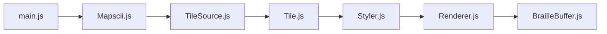

# rastapasta/mapscii

> Visionneuse de cartes du monde en Braille/ASCII pour terminal, en Node.js, pour curieux.

## Le problème
Consulter une carte vectorielle sans navigateur, par exemple sur un serveur en SSH.

## Ce que ça fait vraiment
Décode des tuiles vectorielles (serveur distant ou MBTiles local), applique des styles Mapbox, dessine en Braille ou blocs ASCII, avec souris (glisser, zoom) et raccourcis clavier. Démo publique via telnet.

## Comment c'est branché


## Essayer
```bash
telnet mapscii.me
npx mapscii
npm install -g mapscii
```

## Coût et pièges
Gratuit. Node.js ≥ 10 ; terminal compatible xterm. Dernier push en novembre 2024.

## Ce que ce n'est pas
Pas un outil cartographique d'analyse : démo ludique. Le TODO du README liste encore GeoJSON, étiquettes et rendu de grandes zones non faits.

## Alternatives
Aucune nommée dans le README.

## Pour toi
À ignorer : amusant en terminal mais sans usage data/MLOps, et peu actif depuis fin 2024.

