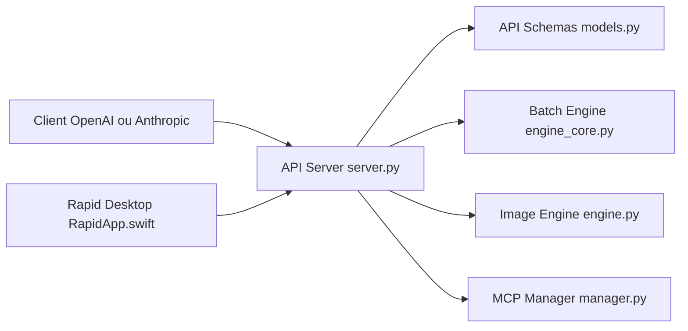

# raullenchai/Rapid-MLX

> Serveur d'inférence local pour Mac Apple Silicon, compatible API OpenAI et Anthropic, pour devs et agents.

## Le problème
Faire tourner des LLM, de la génération d'images ou de la voix en local sur Mac demande de recoller plusieurs outils, avec des clients qui attendent une API OpenAI/Anthropic.

## Ce que ça fait vraiment
Un CLI `rapid-mlx` (chat, serve, pull, recipe…) lance un serveur sur `localhost:8000` avec `/v1/chat/completions`, `/v1/messages`, `/v1/embeddings`, `/v1/audio/*`, `/v1/images/*`, `/v1/videos`. Noyau MLX pur avec batching continu et cache de prompt. Des extras ajoutent vision, audio, vidéo, images. Une commande `launch` configure Claude Code, Cline ou Continue. Il y a aussi une appli Desktop macOS.

## Comment c'est branché


## Essayer
```bash
brew install rapid-mlx
rapid-mlx chat
rapid-mlx serve qwen3.5-4b-4bit
rapid-mlx launch claude-code
```

## Coût et pièges
Mac M-series obligatoire. Premier lancement : ~3 Go de poids. Les gros modèles exigent 32 à 192+ Go de RAM unifiée. Génération image/vidéo sérialisée, minutes par seconde de vidéo.

## Ce que ce n'est pas
Pas multi-plateforme (pas de Linux/Windows). Les chiffres « 3× Ollama » sont ceux des auteurs. Licence présente mais non identifiée par GitHub ; les poids de modèles gardent leurs licences propres.

## Alternatives
- Ollama : cité comme référence de débit.

## Pour toi
À surveiller si tu as un Mac costaud et veux un backend local pour tes agents ; vérifie d'abord la licence réelle et la dépendance à un seul mainteneur.

