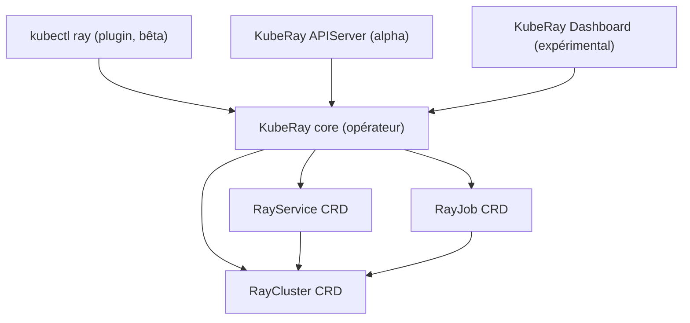

# ray-project/kuberay

> L'opérateur Kubernetes officiel qui fait tourner des clusters Ray comme des ressources natives.

## Le problème
Faire vivre un cluster Ray sur Kubernetes à la main, c'est écrire soi-même l'autoscaling, la
tolérance aux pannes et les mises à jour sans coupure d'un service d'inférence.

## Ce que ça fait vraiment
Fournit trois CRD : `RayCluster` (cycle de vie complet, autoscaling, tolérance aux pannes),
`RayJob` (crée un cluster, soumet le job, peut supprimer le cluster à la fin) et `RayService`
(RayCluster + graphe Ray Serve, mises à jour sans interruption et haute disponibilité).
Autour, trois composants optionnels : un plugin `kubectl ray` (bêta depuis v1.3.0), un
APIServer (alpha) et un dashboard (expérimental depuis v1.4.0, annoncé comme pas encore prêt
pour la production). S'intègre à Prometheus, Grafana, py-spy, Volcano, YuniKorn, Kueue, Nginx.

## Comment c'est branché

## Essayer
Aucune commande documentée dans le README : il renvoie vers les quickstarts RayCluster, RayJob
et RayService hébergés dans la documentation Ray.

## Coût et pièges
Gratuit, mais il faut un cluster Kubernetes et les GPU qui vont avec la charge. Depuis
septembre 2023 toute la documentation utilisateur est partie chez Ray : le dépôt ne garde que
la doc de développement, donc lire ici ne suffit pas.

## Ce que ce n'est pas
Ce n'est pas Ray lui-même, ni un service managé : c'est la couche d'orchestration. Le
dashboard et l'APIServer ne sont pas au même niveau de maturité que le cœur — l'un est
expérimental, l'autre alpha. Les exemples ne sont pas dans ce dépôt.

## Alternatives
- Volcano / Apache YuniKorn / Kueue : cités comme systèmes de file d'attente, complémentaires
  plutôt que concurrents.
- Rien d'autre n'est nommé dans le README comme substitut.

## Pour toi
Le passage obligé si ta plateforme ML tourne sur Kubernetes et que Ray est déjà ton moteur.
