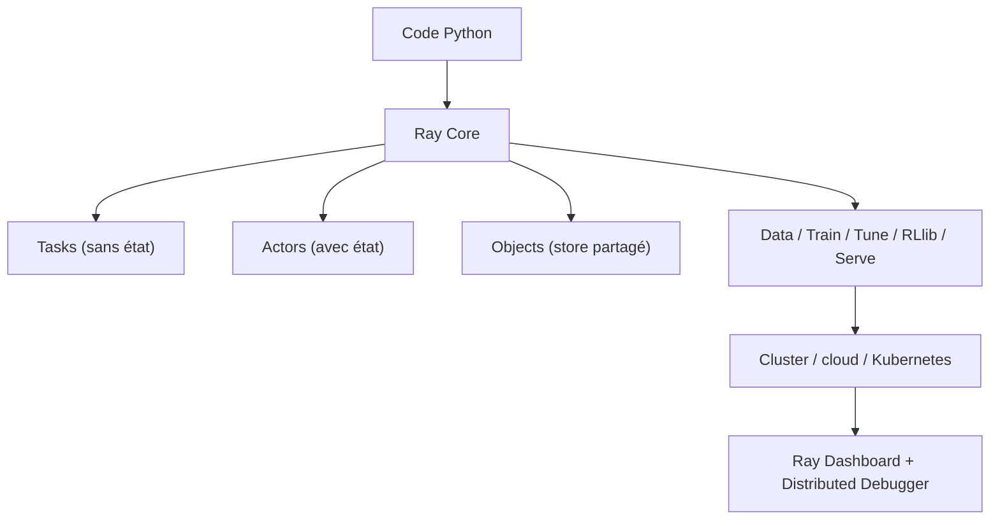

# ray-project/ray

> Runtime distribué Python pour passer d'un portable à un cluster sans réécrire le code.

## Le problème
Un environnement mono-machine ne suit plus les charges d'entraînement et d'inférence actuelles,
et réécrire pour du calcul distribué coûte un projet entier.

## Ce que ça fait vraiment
Fournit trois abstractions de base : Tasks (fonctions sans état exécutées dans le cluster),
Actors (processus workers avec état) et Objects (valeurs immuables accessibles depuis tout le cluster).
Au-dessus, cinq bibliothèques : Data (jeux de données pour le ML), Train (entraînement distribué),
Tune (recherche d'hyperparamètres), RLlib (apprentissage par renforcement) et Serve (service de modèles).
Tourne sur n'importe quelle machine, cluster, cloud ou Kubernetes. Fournit un Ray Dashboard pour
la supervision et un Ray Distributed Debugger.

## Comment c'est branché


## Essayer
```bash
pip install ray
```

## Coût et pièges
Gratuit. Anyscale, le service commercial de l'éditeur, est mis en avant dès le premier badge du
README. Un cluster suppose des ressources à provisionner et à payer chez ton fournisseur.
Les wheels nocturnes passent par une page d'installation séparée.

## Ce que ce n'est pas
Ce n'est pas un ordonnanceur de workflows au sens d'Airflow : il distribue du calcul, il ne
planifie pas des batchs quotidiens. Ce n'est pas un framework de deep learning : il porte les
tiens. Le README annonce explicitement un projet de recherche avec des « sharp edges ».

## Alternatives
Aucune alternative nommée dans le README.

## Pour toi
Le passage à l'échelle par défaut côté Python : Tune pour les hyperparamètres, Serve pour l'inférence.
