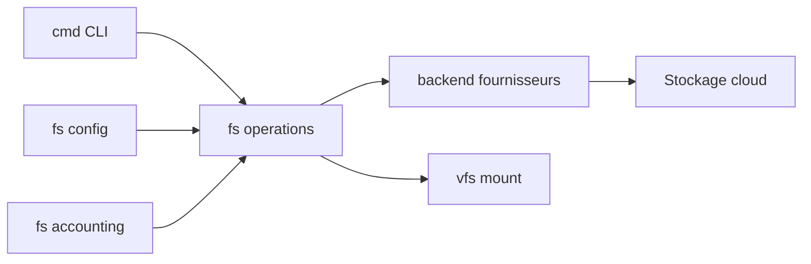

# rclone/rclone

> « rsync pour le stockage cloud » : synchronise et copie des fichiers entre disques et dizaines de services.

## Le problème
Déplacer ou synchroniser des jeux de données entre différents stockages cloud et locaux exige un outil par fournisseur.

## Ce que ça fait vraiment
Commande unique qui copie, synchronise (à sens unique ou bidirectionnel), vérifie les empreintes MD5/SHA-1, monte un stockage via FUSE et sert des fichiers en HTTP, WebDAV, FTP, SFTP ou DLNA. Plus de cent fournisseurs (S3, GCS, Azure, Drive, SFTP…) plus des couches virtuelles : chiffrement (Crypt), compression, découpage (Chunker), union.

## Comment c'est branché

## Essayer
Aucune commande documentée dans ce README : installation et configuration renvoyées au site rclone.org.

## Coût et pièges
Gratuit ; le stockage et le trafic des fournisseurs restent à ta charge, et un compte ou des identifiants par service sont nécessaires. Le backend Cache est marqué déprécié.

## Ce que ce n'est pas
Ce n'est pas un service de sauvegarde clé en main : il faut planifier et surveiller les synchronisations.

## Alternatives
Aucune alternative nommée dans le README.

## Pour toi
Adopter : outil courant pour déplacer datasets et artefacts entre stockages objets.

