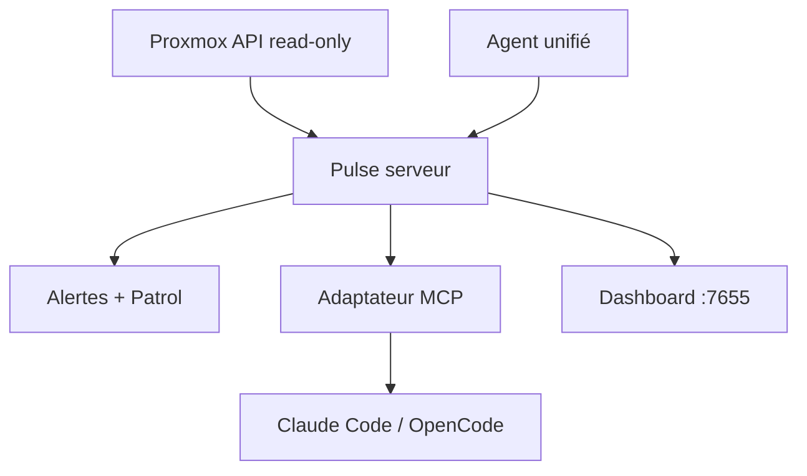

# rcourtman/Pulse

> Espace de monitoring auto-hébergé pour Proxmox, Docker, Kubernetes, TrueNAS et machines.

## Le problème
Surveiller un homelab multi-plateforme (Proxmox, Docker, K8s, TrueNAS, VMs) sans stack de monitoring d'entreprise lourde. Les tableaux de bord ne voient pas les problèmes quand personne ne regarde.

## Ce que ça fait vraiment
État live, historique, alertes, visibilité de récupération et checks planifiés. « Pulse Patrol » fait des rondes et détecte backups échoués, pression capacité, boucles de redémarrage, dérive d'horloge. Chaque plateforme a sa vue, sur un modèle de ressources partagé. Credentials chiffrés au repos, tokens scopés, commandes agent désactivées par défaut. Assistant interactif et adaptateur MCP (Claude Code, OpenCode).

## Comment c'est branché


## Essayer
```bash
docker run -d --name pulse -p 7655:7655 -v pulse_data:/data \
  -e PULSE_DEPLOYMENT_METHOD=docker_run --restart unless-stopped rcourtman/pulse:vX.Y.Z
```

## Coût et pièges
Édition Community gratuite (7 jours d'historique) ; Relay/Pro/MSP payantes ajoutent accès distant, investigation, RBAC, audit. Installer signé (vérification SSH). vSphere en early-access. N'accepte pas de PR non sollicitées.

## Ce que ce n'est pas
Pas une plateforme d'observabilité type Prometheus/Grafana : orienté état d'infra et rondes. Les fonctions avancées sont payantes.

## Alternatives
Non nommées dans le README.

## Pour toi
Pour ton homelab si tu tournes Proxmox/Docker/K8s ; l'adaptateur MCP est un plus. Peu lié au data/IA en soi.
