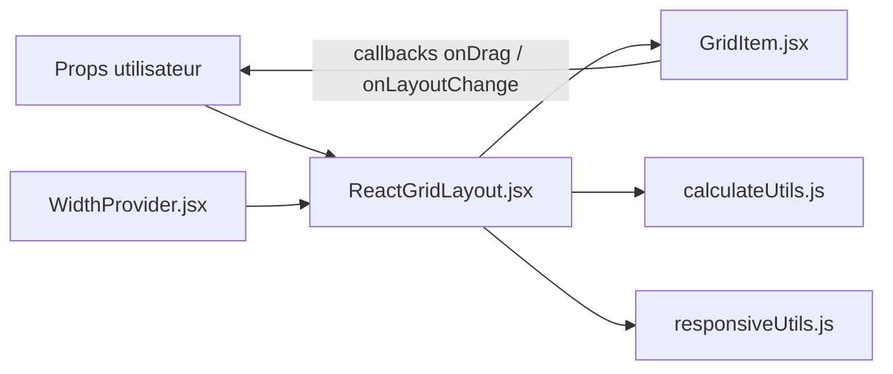

# react-grid-layout/react-grid-layout

> Grille de widgets déplaçables et redimensionnables pour React, utile pour construire des tableaux de bord.

## Le problème
Un tableau de bord où l'utilisateur réarrange ses widgets exige du calcul de placement, de la compaction et des breakpoints responsifs, pénibles à coder soi-même.

## Ce que ça fait vraiment
Composants `ReactGridLayout` et `Responsive`, plus des hooks (`useContainerWidth`, `useGridLayout`, `useResponsiveLayout`). Le layout se décrit par des items `{i, x, y, w, h}`, se sérialise et se restaure. La v2 est une réécriture TypeScript avec compacteurs enfichables et un mode rapide pour 200+ widgets. Une couche `legacy` garde l'API v1. Le README cite Grafana, Metabase et Kibana parmi les utilisateurs.

## Comment c'est branché


## Essayer
```bash
npm install react-grid-layout
```
Puis importer les feuilles de style `react-grid-layout/css/styles.css` et `react-resizable/css/styles.css`.

## Coût et pièges
Gratuit. La v2 exige React 18+ ; la prop `width` est obligatoire (d'où `useContainerWidth`). Les versions 16/17 de React restent sur 0.17.

## Ce que ce n'est pas
Pas un outil de visualisation : elle place des blocs, elle ne trace aucun graphique. Migrer de v1 à v2 demande un changement d'import ou de props.

## Alternatives
Aucune alternative citée dans le README (Packery et Gridster sont mentionnés comme points de comparaison, sans jQuery ici).

## Pour toi
Adopter si tu construis un dashboard React de suivi de modèles ou de métriques : c'est la brique éprouvée derrière plusieurs outils de données connus.

