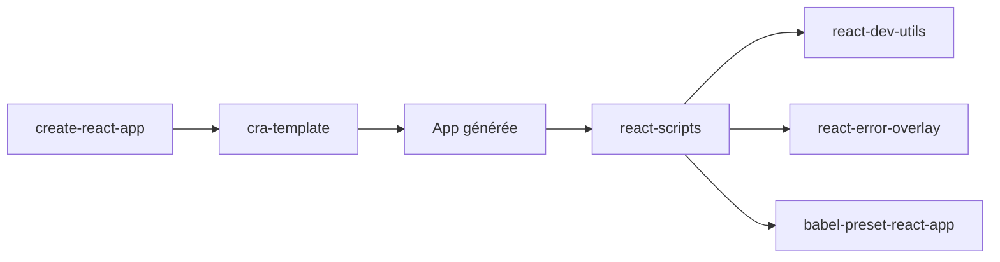

# react/create-react-app

> Générateur de projet React monopage avec build préconfiguré, pour développeurs débutants en React.

## Le problème
Configurer webpack, Babel et ESLint pour démarrer une application React est long et fragile.

## Ce que ça fait vraiment
La commande crée un dossier avec `public/`, `src/` et une dépendance unique, `react-scripts`, qui fournit `start` (serveur de dev, rechargement à chaud), `test` (Jest), `build` (bundle minifié avec hachage) et `eject` (sortie de la config cachée). Autour : templates JS et TypeScript, `react-dev-utils`, un overlay d'erreurs, un preset Babel, une config ESLint, des polyfills.

## Comment c'est branché


## Essayer
```bash
npx create-react-app my-app
cd my-app
npm start
npm run build
```

## Coût et pièges
Gratuit. Node 14.0.0 ou plus requis en local. Dernier push en février 2025, plus de 2 400 issues ouvertes. Les mêmes chiffres et le même README existent dans facebook/create-react-app, doublon probable non vérifié.

## Ce que ce n'est pas
Pas un outil pour du rendu serveur, un site statique ou une intégration Rails/Django : le README renvoie ailleurs pour ces cas. Une fois éjecté, la config devient à ta charge.

## Alternatives
- Next.js : rendu serveur et pré-rendu.
- Gatsby : sites surtout statiques, pré-rendus au build.
- Neutrino : personnalisation plus poussée de la chaîne de build.

## Pour toi
À ignorer : générateur front-end au dernier commit de plus d'un an, sans lien avec un travail data/IA.

