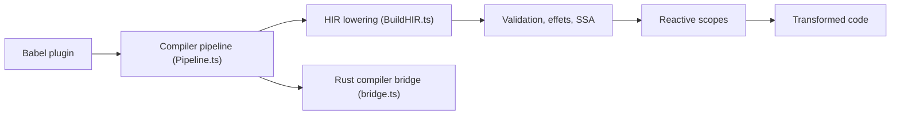

# react/react

> Bibliothèque JavaScript pour construire des interfaces à partir de composants, avec un compilateur de mémoïsation.

## Le problème
Mettre à jour une interface à la main quand l'état change mène vite à du code difficile à raisonner. On veut déclarer l'interface en fonction de l'état.

## Ce que ça fait vraiment
README identique à celui de facebook/react : composants, rendu client, serveur et natif. Le graphe d'architecture insiste ici sur le compilateur React : un plugin Babel appelle `Pipeline.ts`, qui abaisse le code en HIR (`BuildHIR.ts`), infère les effets, valide, optimise, réécrit en SSA, forme des scopes réactifs puis génère le code. Un pont vers un compilateur Rust (`bridge.ts`) et un playground apparaissent dans l'arbre. Le README est tronqué de la même façon (il commence à « Installation »).

## Comment c'est branché


## Essayer
```bash
# Aucune commande documentée dans le README fourni.
```

## Coût et pièges
Gratuit. Ce dépôt semble être le même projet que facebook/react (README identique ; étoiles et dates de push différentes, signe probable d'un renommage), point non vérifié. Ne pas compter deux fois lors du tri.

## Ce que ce n'est pas
Pas une deuxième bibliothèque : rien dans le README n'établit une différence avec facebook/react. Les moteurs de rendu (DOM, natif) ne sont pas détaillés dans le graphe.

## Alternatives
Aucune alternative nommée dans le README.

## Pour toi
À ignorer : doublon apparent de facebook/react, et hors du périmètre data/IA/MLOps ; garde l'entrée facebook/react si tu veux une trace.

