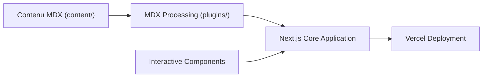

# reactjs/react.dev

> Code source et contenus du site de documentation officiel de React, pour contributeurs.

## Le problème
Contribuer à la documentation de React demande de savoir comment le site est construit et testé.

## Ce que ça fait vraiment
Le dépôt contient un site Next.js dont les contenus sont en Markdown/MDX, avec des exemples interactifs (Sandpack) et des plugins remark. Le README décrit surtout le flux de contribution : fork, branche, `yarn dev`, `yarn check-all`, pull request.

## Comment c'est branché


## Essayer
```bash
yarn
yarn dev
yarn check-all
```

## Coût et pièges
Gratuit. Node 16.8 ou plus et Yarn requis. Contenu sous licence CC-BY-4.0. 1 638 issues ouvertes.

## Ce que ce n'est pas
Pas la bibliothèque React elle-même : c'est le site de sa documentation.

## Alternatives
Aucune alternative nommée dans le README.

## Pour toi
Ignorer, sauf pour contribuer à la doc React : ce n'est pas un outil pour la data/IA.

