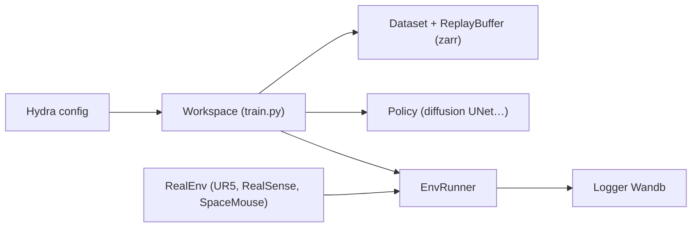

# real-stanford/diffusion_policy

> Code de recherche pour apprendre des politiques de contrôle robotique par diffusion, en simulation et sur robot.

## Le problème
Apprendre des gestes de robot à partir de démonstrations avec des politiques capables de représenter plusieurs comportements.

## Ce que ça fait vraiment
Une architecture sépare tâches (`Dataset`, `EnvRunner`) et méthodes (`Policy`, `Workspace`) pour n'écrire que O(N+M) de code. L'entraînement passe par Hydra (`train.py`), les données par un `ReplayBuffer` zarr, et le multi-seed par Ray. Le dépôt fournit des checkpoints publiés, des notebooks Colab, et une chaîne temps réel avec UR5, RealSense et SpaceMouse via mémoire partagée.

## Comment c'est branché


## Essayer
```bash
mamba env create -f conda_environment.yaml
conda activate robodiff
wandb login
python train.py --config-dir=. --config-name=image_pusht_diffusion_policy_cnn.yaml training.seed=42 training.device=cuda:0
```

## Coût et pièges
Linux avec GPU Nvidia et Wandb ; MuJoCo demande des paquets système. Le robot réel exige du matériel précis (UR5, RealSense D415, SpaceMouse). Dernier push le 2024-12-24 : dépôt peu actif.

## Ce que ce n'est pas
Pas une bibliothèque installable générique : c'est un dépôt de reproduction de résultats d'article. Le multi-processus par `fork` pose des problèmes avec certains environnements OpenGL.

## Alternatives
Aucune alternative nommée dans le README.

## Pour toi
À surveiller : référence utile pour comprendre l'apprentissage par imitation avec diffusion, mais peu maintenue et réservée à qui a un banc de robotique.
