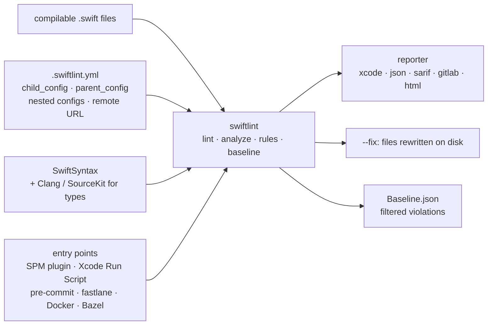

# realm/SwiftLint

> **A command-line linter for Swift style, wired into Xcode or continuous integration.**

## The problem

Without a tool, a team's Swift conventions live only in a document and in review comments:
line length, `force_cast`, short identifier names get re-argued on every pull request, and
nothing guarantees that yesterday's decision still holds tomorrow in another module.

## What it actually does

SwiftLint analyses **compilable** Swift files and reports style deviations, with over 200
built-in rules. Rules are predominantly based on SwiftSyntax; some still hook into Clang and
SourceKit to reach type information.

Configuration lives in a `.swiftlint.yml`: `disabled_rules`, `opt_in_rules`, `only_rules`,
`analyzer_rules`, `included`/`excluded` path lists, per-rule thresholds (`line_length`,
`file_length`, `type_name`…), plus multiple configs that merge (`child_config`,
`parent_config`, nested configs, remote `http(s)://` references).

`swiftlint --fix` rewrites files on disk for correctable violations;
`swiftlint analyze --compiler-log-path` runs extra rules against the type-checked AST from a
clean build log. Rules can also be switched off inline with `// swiftlint:disable <rule>`
(with `:previous`, `:this`, `:next`, or `all`).

You can add your own rules: regex rules declared in YAML (`custom_rules`, with `match_kinds`),
which work with official binaries; or Swift rules, which require rebuilding SwiftLint with
Bazel. Output format is configurable (`reporter`: `xcode`, `json`, `sarif`, `checkstyle`,
`github-actions-logging`, `gitlab`, `junit`, `html`…), and a `baseline` file filters out
pre-existing violations.

## How it is wired

No code-derived diagram exists for this repository: the graph below is reconstructed from the
README alone.



## Trying it

```bash
brew install swiftlint
```

Then, in the directory containing the Swift files (search is recursive):

```bash
swiftlint
swiftlint rules
swiftlint --fix && swiftlint
```

Without installing anything locally, the Docker path given by the README:

```bash
docker pull ghcr.io/realm/swiftlint:latest
docker run -it -v `pwd`:`pwd` -w `pwd` ghcr.io/realm/swiftlint:latest
```

As a pre-commit hook, the README gives this `.pre-commit-config.yaml` block:

```yaml
repos:
  - repo: https://github.com/realm/SwiftLint
    rev: 0.57.1
    hooks:
      - id: swiftlint
```

## Cost and gotchas

- **Free, no API key, no account.** The README mentions no quota and no crippled tier.
- **The code must compile.** The README is explicit: SwiftLint is designed for valid Swift;
  running it before compilation, especially with `--fix`, gives confusing results.
- **`--fix` overwrites files.** The README asks you to keep backups first.
- **`check_for_updates: true`** triggers a version check after each lint or analyze run: an
  outbound network call, worth disabling on machines that should not make one. This is what the
  sheet's alert refers to.
- **Remote configs**: a `parent_config` over `https://` is fetched on every run; with no network
  and no prior cache, SwiftLint fails.
- **Xcode 15**: `ENABLE_USER_SCRIPT_SANDBOXING` now defaults to `YES`, producing
  `Sandbox: swiftlint(...) deny(1) file-read-data`; set it back to `NO` for the target.
- **Apple Silicon**: Homebrew installs into `/opt/homebrew/bin`, absent from the build phase
  `PATH`, hence the "SwiftLint not installed" warning and the symlink workaround.
- **Toolchain**: SwiftLint hooks into SourceKit and should run with the same toolchain that
  compiles the code (`TOOLCHAINS`, `$XCODE_DEFAULT_TOOLCHAIN_OVERRIDE`…; on Linux,
  `/usr/lib/libsourcekitdInProc.so` or `LINUX_SOURCEKIT_LIB_PATH`).
- **Analyzer rules are slow**: `analyze` needs an `xcodebuild` log from a clean build
  (incremental builds fail) and analyzer rules are "considerably" slower than lint rules.
- **Swift custom rules** require rebuilding SwiftLint with Bazel; only regex rules work with an
  official binary.
- **Skipping plugin validation** in CI (`-skipPackagePluginValidation`, `-skipMacroValidation`)
  implicitly trusts all plugins and macros; the README flags the security implication.

## What it is not

- **Not a formatter.** It reports, and only fixes "certain" violations with `--fix`; the rest
  stays on the developer.
- **Not a compiler or a bug finder.** It ships no Swift compiler: it talks to the one already
  installed, and only sees types in `analyze` mode. This is style, not correctness.
- **Not a commercial product**: the README says SwiftLint is maintained by volunteers in their
  free time; Realm (now MongoDB) is credited only with the initial contributions. Expect no
  contractual support.
- **Not a zero-configuration integration**: the recommended SPM plugin path goes through a
  third-party repository, `SimplyDanny/SwiftLintPlugins`, and project structures that require
  `--config` do not work with the build tool plugin.

## Alternatives

| | When to prefer it |
|---|---|
| **SimplyDanny/SwiftLintPlugins** | Named and recommended by the README: same rules, same releases, but SPM/Xcode plugins built for adoption. Prefer it to wire SwiftLint into a Swift package or Xcode project; `realm/SwiftLint` remains the binary and CLI route. |
| **MegaLinter** | Cited in the README: a multi-language linter aggregator for CI that already embeds SwiftLint. Prefer it when the repository is not only Swift and you want a single CI entry point. |

The catalogue neighbours (`Moya/Moya`, `Juanpe/SkeletonView`, `XcodesOrg/XcodesApp`,
`MessageKit/MessageKit`) are Apple-ecosystem libraries and apps: none is a linter, so there is
no comparable alternative among them.

## For you

Little direct overlap with day-to-day data / AI / MLOps work, with one exception: it is a very
readable model of a configurable linter — opt-in rules, a baseline to absorb existing debt,
`sarif`/`gitlab` reports for CI, inline disabling by comment. Adopt it without hesitation as
soon as a repository you own the build chain for contains Swift; skip it otherwise, since the
configuration ideas transfer to `ruff` or `flake8` anyway.
