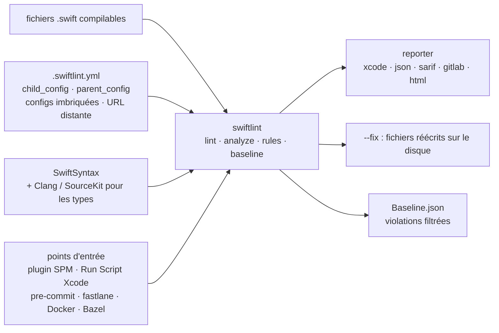

# realm/SwiftLint

> **Linter en ligne de commande pour le style Swift, à brancher dans Xcode ou en intégration continue.**

## Le problème

Sans outil, les conventions Swift d'une équipe ne vivent que dans un document et dans les
commentaires de revue : on rediscute à chaque pull request la longueur des lignes, les
`force_cast`, les noms trop courts, et rien ne garantit que la règle décidée hier soit encore
appliquée demain dans un autre module.

## Ce que ça fait vraiment

SwiftLint analyse des fichiers Swift **compilables** et signale les écarts de style, avec plus
de 200 règles embarquées. Ses règles reposent principalement sur SwiftSyntax ; certaines
passent encore par Clang et SourceKit pour obtenir l'information de type.

La configuration tient dans un `.swiftlint.yml` : `disabled_rules`, `opt_in_rules`,
`only_rules`, `analyzer_rules`, listes `included`/`excluded`, seuils par règle (`line_length`,
`file_length`, `type_name`…), et des configurations multiples qui fusionnent (`child_config`,
`parent_config`, configurations imbriquées, références distantes en `http(s)://`).

`swiftlint --fix` réécrit les fichiers sur le disque pour corriger ce qui est corrigible ;
`swiftlint analyze --compiler-log-path` lance des règles supplémentaires sur l'AST typé à
partir d'un journal de compilation propre. Les règles s'éteignent aussi ponctuellement dans le
code par commentaire `// swiftlint:disable <règle>` (avec variantes `:previous`, `:this`,
`:next`, ou `all`).

On peut définir ses propres règles : des règles regex déclarées dans le YAML (`custom_rules`,
avec `match_kinds`), utilisables avec un binaire officiel ; ou des règles Swift, qui exigent de
recompiler SwiftLint avec Bazel. Le format de sortie est configurable (`reporter` : `xcode`,
`json`, `sarif`, `checkstyle`, `github-actions-logging`, `gitlab`, `junit`, `html`…), et un
mécanisme de `baseline` filtre les violations déjà existantes.

## Comment c'est branché

Aucun diagramme tiré du code n'existe pour ce dépôt : ce schéma est reconstruit depuis le seul
README.



## Essayer

```bash
brew install swiftlint
```

Puis, dans le répertoire contenant les fichiers Swift (la recherche est récursive) :

```bash
swiftlint
swiftlint rules
swiftlint --fix && swiftlint
```

Sans rien installer sur la machine, la voie Docker donnée par le README :

```bash
docker pull ghcr.io/realm/swiftlint:latest
docker run -it -v `pwd`:`pwd` -w `pwd` ghcr.io/realm/swiftlint:latest
```

En crochet de pré-commit, le README donne ce bloc de `.pre-commit-config.yaml` :

```yaml
repos:
  - repo: https://github.com/realm/SwiftLint
    rev: 0.57.1
    hooks:
      - id: swiftlint
```

## Coût et pièges

- **Gratuit, sans clé d'API ni compte.** Le README ne mentionne ni quota ni version bridée.
- **Le code doit compiler.** Le README insiste : SwiftLint est conçu pour du code Swift valide ;
  le lancer avant compilation, surtout avec `--fix`, donne des résultats inattendus.
- **`--fix` écrase les fichiers.** Le README demande explicitement d'avoir des sauvegardes.
- **`check_for_updates: true`** déclenche une vérification de version après chaque lint ou
  analyse : c'est un appel réseau sortant, à désactiver sur un poste ou une machine de CI qui
  n'en veut pas. C'est ce qui motive l'alerte de la fiche.
- **Configurations distantes** : un `parent_config` en `https://` va chercher le fichier à
  chaque exécution ; sans connexion et sans cache préalable, SwiftLint échoue.
- **Xcode 15** : `ENABLE_USER_SCRIPT_SANDBOXING` passé à `YES` par défaut provoque
  `Sandbox: swiftlint(...) deny(1) file-read-data` ; il faut le remettre à `NO` pour la cible.
- **Apple Silicon** : Homebrew installe dans `/opt/homebrew/bin`, absent du `PATH` de la phase
  de build ; d'où l'avertissement « SwiftLint not installed » et le lien symbolique de contournement.
- **Chaîne d'outils** : SwiftLint s'appuie sur SourceKit et doit tourner avec la même toolchain
  que celle qui compile le code (`TOOLCHAINS`, `$XCODE_DEFAULT_TOOLCHAIN_OVERRIDE`… ; sous Linux,
  `/usr/lib/libsourcekitdInProc.so` ou `LINUX_SOURCEKIT_LIB_PATH`).
- **Règles d'analyse lentes** : `analyze` exige un journal `xcodebuild` d'une compilation propre
  (les builds incrémentaux échouent) et les règles analyzer sont « considérablement » plus lentes.
- **Règles Swift personnalisées** : elles imposent de reconstruire SwiftLint avec Bazel ; seules
  les règles regex marchent avec un binaire officiel.
- **Désactiver les validations de plugins** en CI (`-skipPackagePluginValidation`,
  `-skipMacroValidation`) revient à faire confiance à tous les plugins et macros : le README le
  signale comme une décision de sécurité.

## Ce que ce n'est pas

- **Ce n'est pas un formateur.** SwiftLint signale, et ne corrige que « certaines » violations
  via `--fix` ; le reste reste à la charge du développeur.
- **Ce n'est pas un compilateur ni un analyseur de bugs.** Il n'embarque pas de compilateur Swift :
  il parle à celui déjà installé, et ne voit le type qu'en mode `analyze`. C'est du style, pas de
  la correction fonctionnelle.
- **Ce n'est pas un produit commercial** : le README le dit, SwiftLint est maintenu par des
  bénévoles sur leur temps libre ; Realm (aujourd'hui MongoDB) n'est crédité que des contributions
  initiales. Aucun support contractuel à en attendre.
- **Ce n'est pas une intégration « zéro configuration »** : le chemin recommandé pour les plugins
  SPM passe par un dépôt tiers, `SimplyDanny/SwiftLintPlugins`, et les structures de projet qui
  imposent `--config` ne fonctionnent pas avec le plugin de build.

## Alternatives

| | Quand le préférer |
|---|---|
| **SimplyDanny/SwiftLintPlugins** | Nommé dans le README, et recommandé par lui : mêmes règles, mêmes versions, mais des plugins SPM/Xcode pensés pour l'adoption. À préférer pour brancher SwiftLint dans un package Swift ou un projet Xcode ; le dépôt `realm/SwiftLint` reste la voie du binaire et du CLI. |
| **MegaLinter** | Cité dans le README : agrégateur de linters multi-langages pour la CI, qui embarque déjà SwiftLint. À préférer quand le dépôt n'est pas que du Swift et qu'on veut un seul point d'entrée en intégration continue. |

Les voisins du catalogue (`Moya/Moya`, `Juanpe/SkeletonView`, `XcodesOrg/XcodesApp`,
`MessageKit/MessageKit`) sont des bibliothèques ou des applications de l'écosystème Apple : aucun
n'est un linter, donc aucune alternative comparable de ce côté.

## Pour toi

Peu de recouvrement direct avec un quotidien data / IA / MLOps, sauf sur un point : c'est un
modèle très lisible de linter configurable — règles opt-in, baseline pour absorber la dette
existante, rapports `sarif`/`gitlab` pour la CI, désactivation locale par commentaire. À adopter
sans réfléchir dès qu'il y a du Swift dans un dépôt dont on tient la chaîne de build ; à ignorer
s'il n'y en a pas, les idées de configuration se transposant de toute façon à `ruff` ou `flake8`.
