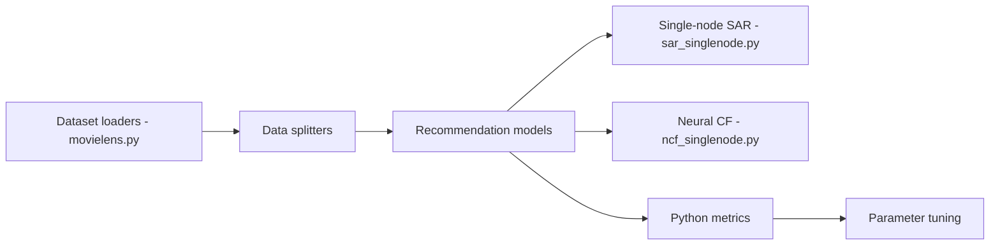

# recommenders-team/recommenders

> Boîte à outils Python et notebooks pour prototyper, évaluer et déployer des systèmes de recommandation.

## Le problème
Mettre en place des recommandeurs demande de préparer les données, comparer des algorithmes et évaluer hors ligne de façon reproductible.

## Ce que ça fait vraiment
Cinq tâches : préparer les données, modéliser, évaluer, sélectionner/optimiser, opérationnaliser sur Azure. Utilitaires de chargement (MovieLens), découpage et métriques Python/Spark. Plus de trente algorithmes (ALS, SAR, NCF, LightGCN, SASRec, xDeepFM, Wide & Deep, VAE…), avec un benchmark MovieLens 100k dans le README. Projet sous la Linux Foundation AI & Data.

## Comment c'est branché


## Essayer
```bash
curl -LsSf https://astral.sh/uv/install.sh | sh
uv venv ~/.venvs/recommenders --python 3.11
source ~/.venvs/recommenders/bin/activate
uv pip install recommenders
git clone https://github.com/recommenders-team/recommenders.git
```

## Coût et pièges
Gratuit. Extras : `[gpu]`, `[spark]`, `[dev]`, `[experimental]`. Il faut gcc. L'opérationnalisation documentée vise Azure.

## Ce que ce n'est pas
Pas un service de recommandation prêt à déployer : ce sont des exemples et briques. Les modèles marqués `*` viennent de Microsoft ; certains sont expérimentaux.

## Alternatives
Aucune alternative nommée dans le README.

## Pour toi
À adopter pour un prototype de recommandation ou un benchmark d'algorithmes : couverture large, MIT, activité récente.

