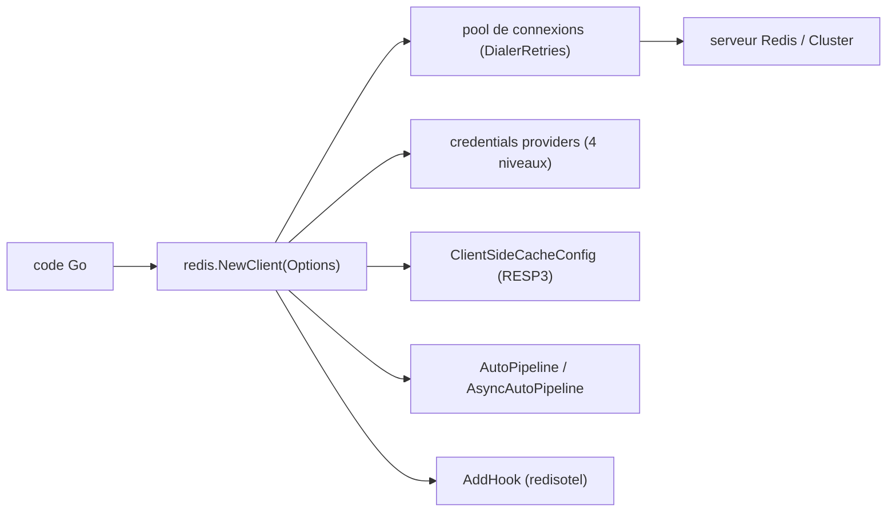

# redis/go-redis

> Le client Redis officiel pour Go, avec pooling, cluster et cache côté client.

## Le problème
Parler à Redis depuis Go demande plus qu'un socket : pool de connexions, RESP2/RESP3, cluster,
sentinelles, réessais, et une authentification qui peut tourner en cours de vie de la connexion.

## Ce que ça fait vraiment
Toutes les commandes sauf QUIT et SYNC, pooling automatique, Pub/Sub, pipelines et transactions,
scripting, Sentinel, Cluster. Quatre sources d'identifiants par ordre de priorité, du
`StreamingCredentialsProvider` (expérimental, pour Entra ID) aux champs `Username`/`Password`.
Cache côté client borné par `ClientSideCacheConfig`, invalidé par les notifications RESP3.
Pipelining automatique expérimental, en version bloquante (`AutoPipeline`) et différée
(`AsyncAutoPipeline`). Fonctions d'erreurs typées (`IsLoadingError`, `IsOOMError`, `IsMovedError`…).

## Comment c'est branché


## Essayer
```bash
go mod init github.com/my/repo
go get github.com/redis/go-redis/v9
```
```go
rdb := redis.NewClient(&redis.Options{Addr: "localhost:6379", Protocol: 3})
defer rdb.Close()
err := rdb.Set(ctx, "key", "value", 0).Err()
```

## Coût et pièges
Le cache côté client exige RESP3, un client standalone et la base 0, et refuse `SELECT`, `AUTH`,
`RESET`, `CLIENT TRACKING` — une commande interdite fait échouer tout son pipeline. En autopipelining,
le contexte d'une commande n'est plus honoré une fois mise en file, et un lot rejoué après coupure
peut exécuter deux fois une commande non idempotente. `Do` est le mauvais outil pour toute commande
qui modifie l'état de session : utiliser `client.Conn()`.

## Ce que ce n'est pas
Pas un serveur ni un cache local autonome. Plusieurs surfaces sont explicitement expérimentales —
type array `AR*` (Redis 8.8+), autopipelining, cache client, credentials en flux — et le README
demande d'épingler la version si on les adopte. `UnstableResp3` est devenu sans effet.

## Alternatives
- `go-redis-entraid` : l'extension nommée pour l'authentification Entra ID.

## Pour toi
Le client de référence si un de tes services est en Go ; laisse les options expérimentales de côté.
