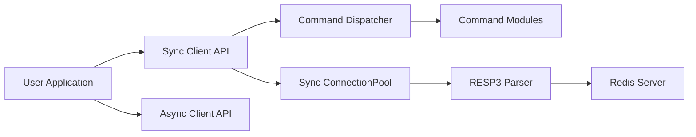

# redis/redis-py

> Client Python officiel de Redis, synchrone et asynchrone, cluster et Sentinel.

## Le problème
Parler à Redis depuis Python (cache, file, pub/sub, recherche vectorielle) exige un client fiable et complet.

## Ce que ça fait vraiment
Toutes les commandes Redis sous leur nom, pool de connexions, pipelines (MULTI/EXEC), PubSub.
Clients async, cluster, Sentinel ; parseur RESP2/RESP3, accéléré par hiredis si présent.
Commandes de recherche (`ft()`) avec dialecte 2 par défaut depuis la 6.0.
Client multi-bases avec bascule automatique ; import en masse HIMPORT (Redis 8.10).

## Comment c'est branché


## Essayer
```bash
docker run -p 6379:6379 -it redis:latest
pip install redis
pip install "redis[hiredis]"
```

## Coût et pièges
Gratuit ; un serveur Redis est nécessaire. Python 3.9+ depuis 6.2.0. Le dialecte de recherche par défaut peut changer tes résultats.

## Ce que ce n'est pas
Pas un ORM : pour le mapping objet, redis-om-python est conseillé.

## Alternatives
- redis-om-python : mapping objet de plus haut niveau, cité par le README.

## Pour toi
À adopter dès qu'un pipeline ou service ML touche Redis (cache de features, file, vecteurs) : client de référence maintenu par Redis Inc.
