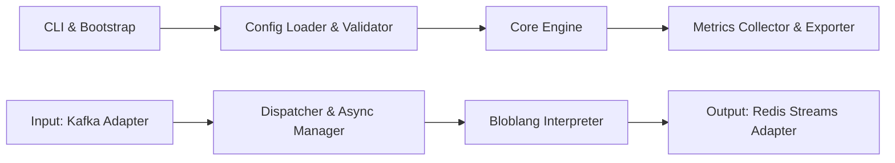

# redpanda-data/connect

> Processeur de flux en un binaire qui relie sources et destinations via des pipelines YAML déclaratifs.

## Le problème
Déplacer et transformer des données entre bases, brokers et stockages cloud oblige à coder et opérer des connecteurs sur mesure.

## Ce que ça fait vraiment
Un fichier YAML décrit `input`, processeurs et `output` ; le binaire Go s'exécute en conteneur ou seul. Large catalogue (Kafka, NATS, AWS, GCP, Azure, SQL, MongoDB, HTTP…), CDC pour Postgres, MySQL, MongoDB, Oracle, MSSQL, sortie Iceberg. Transformations en Bloblang. Livraison au moins une fois sans état disque. Sondes `/ping` et `/ready`, métriques Prometheus/Statsd, traces OpenTelemetry. Plugins Go possibles.

## Comment c'est branché


## Essayer
```bash
brew install redpanda-data/tap/redpanda
docker pull docker.redpanda.com/redpandadata/connect
rpk connect run ./config.yaml
task build:all
```

## Coût et pièges
Binaire gratuit ; GitHub n'identifie aucune licence pour ce dépôt, à vérifier (certains composants peuvent relever de conditions Redpanda). Connecteurs à dépendances C exclus sans le tag `x_benthos_extra`.

## Ce que ce n'est pas
Pas un broker ni un moteur de calcul avec état (pas de fenêtres agrégées persistées) : il transporte et transforme message par message.

## Alternatives
Aucune alternative nommée dans le README.

## Pour toi
À surveiller : le CDC Postgres vers Iceberg en un YAML est très utile pour un pipeline data, mais l'absence de licence déclarée impose de clarifier les conditions avant tout usage en entreprise.
