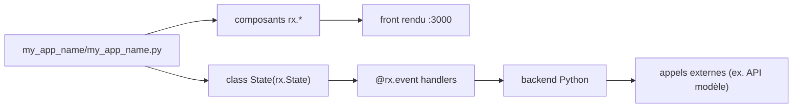

# reflex-dev/reflex

> Écrire une application web complète, front et back, en Python seul.

## Le problème
Exposer un modèle ou un traitement Python impose d'apprendre un framework JavaScript en plus.
Séparer front et back pour une simple démo multiplie le code et les déploiements.

## Ce que ça fait vraiment
L'interface se décrit en Python (`rx.vstack`, `rx.input`, `rx.button`, `rx.image`) ; l'état vit dans une classe `rx.State`.
Les gestionnaires d'événements sont des méthodes décorées `@rx.event`, y compris asynchrones, avec `yield` pour un rendu intermédiaire.
Rechargement rapide : la modification du source est visible immédiatement, l'application tourne sur `localhost:3000`.
Autour : un AI Builder qui génère des applications, un Agent Toolkit (MCP et skills) et un service de déploiement.

## Comment c'est branché


## Essayer
```bash
mkdir my_app_name
cd my_app_name
uv init
uv add reflex
uv run reflex init
uv run reflex run
```

## Coût et pièges
La bibliothèque est gratuite ; l'AI Builder, la gestion d'applications et le déploiement sont des services de l'éditeur.
Un environnement virtuel est fortement recommandé sous peine de ne pas avoir la commande `reflex` dans le PATH.
L'exemple appelle un modèle d'image OpenAI : cette partie-là est facturée.

## Ce que ce n'est pas
Ce n'est pas du Python exécuté dans le navigateur : l'architecture réelle est renvoyée à une page de documentation, pas décrite ici.
Ce n'est pas un notebook ni un outil de dashboard : c'est un framework d'application, avec la maintenance que cela suppose.
Le README est très court et n'indique ni prérequis de version, ni licence.

## Alternatives
Aucune alternative nommée dans le README.

## Pour toi
Le choix raisonnable quand une démo Streamlit ne suffit plus mais qu'un vrai front TypeScript serait de trop.
