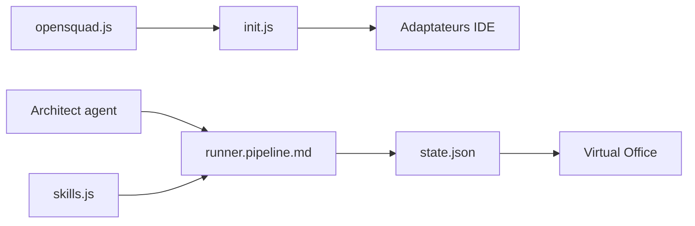

# renatoasse/opensquad

> Framework d'orchestration multi-agents lancé depuis l'IDE, pour créer des équipes d'agents IA à pipeline.

## Le problème
Enchaîner recherche, rédaction et design avec plusieurs agents demande un cadre de pipeline et de validation humaine.

## Ce que ça fait vraiment
Le CLI Node installe dans ton projet des instructions propres à chaque IDE (Claude Code, Cursor, Codex, Gemini CLI…) et un système de squads : un Architecte conçoit agents, tâches et pipeline, avec points de contrôle. L'exécution et les permissions restent à l'IDE hôte. Skills installables, navigation Playwright et tableau de bord 2D (React et Phaser).

## Comment c'est branché


## Essayer
```bash
npx opensquad init
npx opensquad update
npx serve squads/<nom-du-squad>/dashboard
```
Puis, dans l'IDE : `/opensquad`, `/opensquad create`, `/opensquad run <squad>`.

## Coût et pièges
Gratuit comme logiciel, mais chaque exécution consomme des tokens payants sur Claude Code ou l'API OpenAI. Les cookies de navigateur peuvent être conservés dans `_opensquad/_browser_profile/`.

## Ce que ce n'est pas
Pas un serveur d'agents : il fournit des prompts. Les checkpoints ne sont que des instructions. Le catalogue n'a aucune licence, alors que le README annonce MIT.

## Alternatives
Aucune alternative nommée dans le README.

## Pour toi
À surveiller : approche intéressante de squads d'agents, mais licence non déclarée dans le catalogue et coûts de tokens à mesurer.

