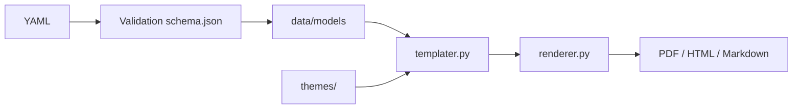

# rendercv/rendercv

> Générateur de CV en PDF à partir d'un fichier YAML, pour universitaires et ingénieurs.

## Le problème
Mettre en page un CV à la main dans un traitement de texte est fastidieux, non versionnable et incohérent.

## Ce que ça fait vraiment
Tu écris ton CV en YAML (avec du Markdown), RenderCV le valide strictement avec un schéma JSON (complétion dans l'éditeur), le traduit en Typst puis en PDF ; il peut aussi sortir du Markdown et du HTML. Neuf thèmes, options de design (marges, couleurs, typographie), langues configurables. Un skill d'agent installable (`rendercv/rendercv-skill`) permet à un agent de créer ou modifier ton CV.

## Comment c'est branché


## Essayer
```bash
pip install "rendercv[full]"
rendercv new "John Doe"
rendercv render "John_Doe_CV.yaml"
npx skills add rendercv/rendercv-skill
```

## Coût et pièges
Gratuit. Python 3.12+ requis. Ne mets pas de données personnelles réelles dans un dépôt public.

## Ce que ce n'est pas
Ce n'est pas un éditeur visuel ni un service de candidature : c'est un compilateur de texte vers PDF.

## Alternatives
Le README ne cite aucune alternative.

## Pour toi
À adopter : un CV versionné en YAML se met à jour comme du code et se prête bien à l'assistance par agent.

