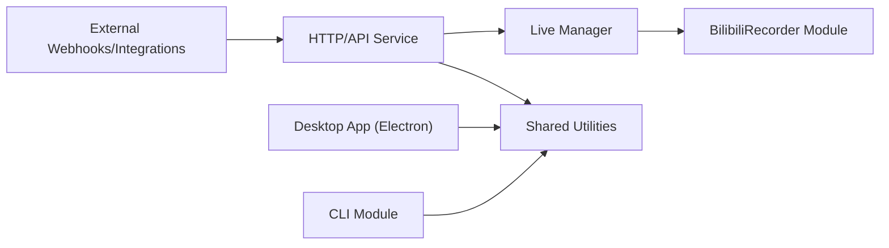

# renmu123/biliLive-tools

> Boîte à outils chinoise pour enregistrer des lives, incruster les commentaires et publier sur Bilibili.

## Le problème
Traiter un enregistrement de live avec ses commentaires (« danmaku ») exige plusieurs logiciels, parfois en ligne de commande seule.

## Ce que ça fait vraiment
README en chinois. Enregistrement de Douyu, Huya, Bilibili, Douyin, Xiaohongshu, TikTok ; conversion XML vers ASS ; incrustation des commentaires dans la vidéo ; upload Bilibili ; synchronisation avec des disques réseau ; réception de webhooks (BililiveRecorder, blrec, DDTV) ; découpage basé sur les commentaires ; en option, découpe musicale et paroles assistées par LLM. Monorepo pnpm : application Electron, CLI, service HTTP, conteneurs API et WebUI. L'auteur dit ne collecter aucune donnée.

## Comment c'est branché

## Essayer
Aucune commande documentée dans le README : installation par téléchargement d'un client (releases) ; documentation externe (docs.irenmu.com).

## Coût et pièges
Gratuit ; FFmpeg et DanmakuFactory utilisés en interne. Les plateformes visées sont chinoises ; comptes Bilibili nécessaires pour l'upload.

## Ce que ce n'est pas
Pas un outil de streaming. Pas documenté en anglais dans le README.

## Alternatives
BililiveRecorder (enregistreur cité en références).

## Pour toi
À ignorer : chaîne de traitement de lives de niche, sans lien avec un travail data/IA/MLOps.

