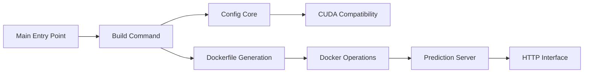

# replicate/cog

> CLI de Replicate qui empaquette un modèle ML dans une image Docker avec API HTTP générée.

## Le problème
Livrer un modèle en production oblige à écrire Dockerfile, serveur HTTP et à accorder versions CUDA/cuDNN/PyTorch à la main.

## Ce que ça fait vraiment
Tu décris l'environnement dans `cog.yaml` (GPU, paquets système, Python, requirements) et l'inférence dans une classe `Runner` avec `setup()` et `run()` typés. Cog génère l'image Docker, choisit une combinaison CUDA compatible, produit un schéma OpenAPI et sert une API REST (serveur Rust/Axum). `cog run`, `cog build`, `cog serve` couvrent l'exécution locale et le déploiement.

## Comment c'est branché


## Essayer
```bash
brew install replicate/tap/cog
sh <(curl -fsSL https://cog.run/install.sh)
cog run -i image=@input.jpg
cog build -t my-classification-model
cog serve -p 8080
```

## Coût et pièges
Docker requis (plus Buildx avec Docker Engine) ; Windows seulement via WSL 2. Gratuit en local, facture uniquement si tu déploies sur Replicate.

## Ce que ce n'est pas
Pas un orchestrateur de cluster ni un outil d'autoscaling : il produit une image, à toi de la faire tourner. Pas de support Windows natif.

## Alternatives
Aucune alternative nommée dans le README.

## Pour toi
À adopter pour conteneuriser vite un modèle : le couple `cog.yaml` + `Runner` typé règle l'enfer CUDA et donne une API documentée sans écrire de Dockerfile, pile ce qui ralentit le passage du notebook au service.
