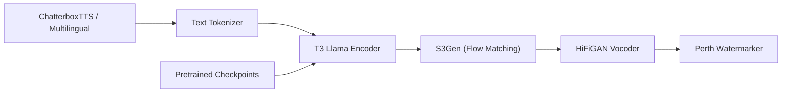

# resemble-ai/chatterbox

> Famille de modèles open source de synthèse vocale avec clonage de voix, pour agents et applications multilingues.

## Le problème
Les meilleures voix de synthèse sont souvent payantes ou fermées ; il faut un modèle ouvert, contrôlable et déployable soi-même.

## Ce que ça fait vraiment
Plusieurs modèles : Turbo (350M, anglais, latence faible, étiquettes comme `[laugh]`), Nano (110M, tourne sur CPU, 3 fois plus vite que le temps réel sur 8 cœurs), Multilingual V3 (500M, 23 langues) et six finetunes par langue. Un extrait audio de référence permet de cloner une voix. Chaque audio généré porte un filigrane neuronal PerTh, détectable par script. L'architecture (tokenizer, encodeur T3, s3gen, vocodeur HiFiGAN) est une chaîne PyTorch.

## Comment c'est branché


## Essayer
```bash
pip install chatterbox-tts
```
```python
from chatterbox.tts_turbo import ChatterboxTurboTTS
model = ChatterboxTurboTTS.from_pretrained(device="cuda")
wav = model.generate(text, audio_prompt_path="your_10s_ref_clip.wav")
```

## Coût et pièges
Gratuit ; GPU conseillé (Nano permet le CPU). Testé sur Python 3.11, Debian 11. Le clonage de voix soulève des questions de consentement ; le README ajoute un avertissement d'usage. Un service payant existe en option chez l'éditeur.

## Ce que ce n'est pas
Ce n'est pas un service hébergé (le service payant est distinct). La qualité comparée à ElevenLabs et autres repose sur des évaluations menées par l'éditeur.

## Alternatives
- ElevenLabs Turbo v2.5, Cartesia Sonic 3 et VibeVoice 7B : comparés dans les évaluations Podonos citées.

## Pour toi
Adopter : modèle TTS MIT, de tailles adaptées du CPU au GPU, idéal pour prototyper des agents vocaux en local.

