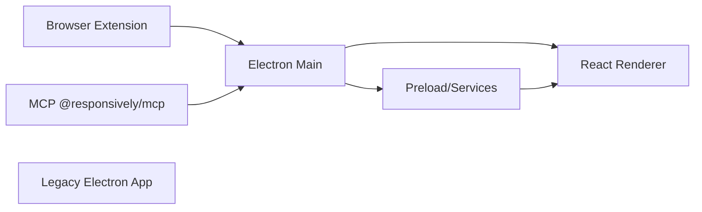

# responsively-org/responsively-app

> Navigateur Electron qui affiche une page sur plusieurs appareils à la fois, pour les développeurs web.

## Le problème
Tester un rendu responsive oblige à ouvrir plusieurs fenêtres ou à basculer d'un émulateur à l'autre, sans voir les résultats côte à côte.

## Ce que ça fait vraiment
Affiche une même URL dans plusieurs aperçus d'appareils (30+ profils, personnalisables). Les interactions sont répercutées sur tous les aperçus, avec un inspecteur unique, des captures d'écran en un clic et le rechargement à chaud. Le README décrit aussi un serveur MCP intégré, pilotable depuis Claude Code ou Cursor, et une extension de navigateur qui envoie des liens à l'app.

## Comment c'est branché


## Essayer
```bash
brew install --cask responsively
winget install ResponsivelyApp
claude mcp add responsively -- npx -y @responsively/mcp
```

## Coût et pièges
Gratuit, aucun compte. Sous Linux, l'AppImage doit être lancée une fois avant de brancher un agent MCP. Le serveur MCP écoute en local sur le port 12720.

## Ce que ce n'est pas
Ce n'est pas un vrai banc d'essai multi-navigateurs : c'est un moteur Electron (Chromium), donc pas de rendu Safari ni Firefox. Un dossier « legacy » cohabite avec l'app moderne.

## Alternatives
Aucune alternative nommée dans le README.

## Pour toi
Surveiller : utile pour valider vite un front d'app de données (dashboard, Streamlit exposé), mais outil de web design sans lien direct avec la data ; l'AGPL gêne toute réutilisation du code.

