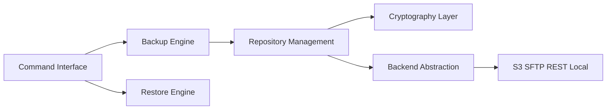

# restic/restic

> Programme de sauvegarde chiffré et dédupliqué, avec de nombreux backends de stockage.

## Le problème
Les sauvegardes sont oubliées si elles sont lentes ou compliquées, et perdent leur valeur si la restauration n'est pas vérifiable.

## Ce que ça fait vraiment
`restic init` crée un dépôt chiffré ; `restic backup` y enregistre des instantanés, dédupliqués par blocs. La couche dépôt gère blobs, index et paquets ; la couche backend abstrait le stockage (local, SFTP, REST, S3, Swift, B2, Azure, Google Cloud, plus rclone). On restaure avec `restic restore` ou on monte les instantanés en FUSE.

## Comment c'est branché


## Essayer
```bash
restic init --repo /tmp/backup
restic --repo /tmp/backup backup ~/work
restic restore
restic mount
```

## Coût et pièges
Gratuit. Perdre le mot de passe du dépôt rend les données irrécupérables : le README le dit. Le stockage distant (S3, etc.) reste à ta charge.

## Ce que ce n'est pas
Pas une sauvegarde à lui seul : le README rappelle qu'une copie sur la même machine n'est pas une stratégie. Pas de planification intégrée, non documentée ici.

## Alternatives
Aucune alternative nommée dans le README (rclone est cité comme backend, pas comme rival).

## Pour toi
À adopter pour sauvegarder jeux de données, artefacts de modèles et configurations : chiffrement, déduplication et binaires reproductibles.

