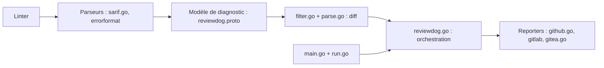

# reviewdog/reviewdog

> Outil qui transforme la sortie de n'importe quel linter en commentaires de revue sur les lignes modifiées.

## Le problème
Les linters produisent du bruit sur tout le code ; en revue de PR, on veut seulement les problèmes introduits par le diff.

## Ce que ça fait vraiment
Lit la sortie d'un linter (errorformat, rdjson, checkstyle, SARIF, diff), la compare au diff, filtre les résultats et les publie : en local, en GitHub Checks, en commentaires de PR, en GitLab, Gerrit, Bitbucket. Peut lancer des outils déclarés dans `.reviewdog.yml`, proposer des suggestions de code et échouer selon un niveau de gravité.

## Comment c'est branché


## Essayer
```bash
curl -sfL https://raw.githubusercontent.com/reviewdog/reviewdog/fd59714416d6d9a1c0692d872e38e7f8448df4fc/install.sh | sh -s
golint ./... | reviewdog -f=golint -diff="git diff FETCH_HEAD"
reviewdog -diff="git diff FETCH_HEAD" -runners=golint,govet
```

## Coût et pièges
Gratuit. Jeton d'API requis pour publier (`REVIEWDOG_GITHUB_API_TOKEN`, etc.). L'option GitHub App dépend d'un serveur maintenu par l'auteur, sans garantie de disponibilité (le README le dit).

## Ce que ce n'est pas
Ce n'est pas un linter : il ne détecte rien lui-même. Sur les PR venant de forks, les droits limités ne permettent que des annotations.

## Alternatives
- reviewdog/action-setup et les actions publiques (hadolint, shellcheck, etc.) : pour GitHub Actions.

## Pour toi
À adopter : branche ruff, mypy, sqlfluff ou hadolint dans la CI pour ne commenter que le code modifié, sans changer tes linters.

