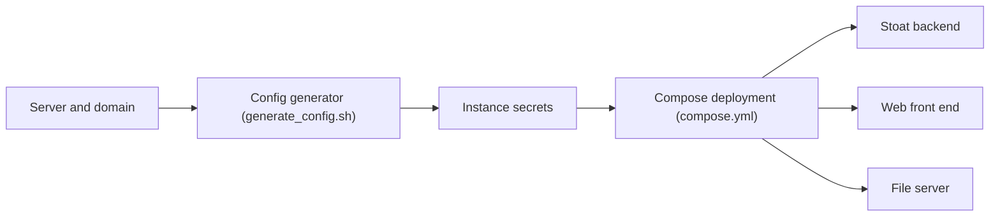

# revoltchat/self-hosted

> Configuration Docker Compose pour auto-héberger une instance Stoat (ex-Revolt), pour opérateurs de serveurs.

## Le problème
Déployer soi-même une messagerie complète (backend, web, fichiers, proxy, vidéo) sans la monter pièce par pièce.

## Ce que ça fait vraiment
Le dépôt ne contient pas l'application mais la configuration : `generate_config.sh` crée `Revolt.toml` et `secrets.env`, `compose.yml` lance backend, front web, serveur de fichiers, proxy de métadonnées/images et Caddy. Il couvre mise à jour, migrations (MinIO vers silo, Autumn), ports LiveKit et avis de sécurité.

## Comment c'est branché

Le contenu de Compose et Caddy n'a pas été inspecté.

## Essayer
```bash
git clone https://github.com/stoatchat/self-hosted stoat
cd stoat
chmod +x ./generate_config.sh
./generate_config.sh your.domain
docker compose up -d
```

## Coût et pièges
Serveur de 2 vCPU et 2 Go minimum, domaine, ports 80/443/7881 et 50000-50100/udp. Sauvegarder `secrets.env` : le perdre coupe l'accès aux fichiers. Exposer la base ouvre un accès public malgré ufw.

## Ce que ce n'est pas
Pas le code de Stoat. La plupart des clients officiels ne gèrent pas les instances auto-hébergées. Licence AGPL-3.0.

## Alternatives
Aucune alternative nommée dans le README.

## Pour toi
À ignorer pour un profil data/IA : c'est de l'hébergement de messagerie sans lien avec ton métier.

