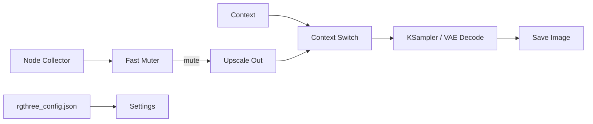

# rgthree/rgthree-comfy

> Collection de nœuds et d'améliorations d'interface pour ComfyUI, pour utilisateurs avancés de workflows.

## Le problème
Un workflow ComfyUI devient vite illisible : spaghettis de liens, branches à activer/désactiver à la main.
Les switches des autres suites laissent tourner les branches inutiles et gaspillent du GPU.

## Ce que ça fait vraiment
Nœuds de contrôle : Seed, Reroute, Bookmark, Context / Context Big, Context Switch, Any Switch.
Panneaux de pilotage : Fast Muter, Fast Bypasser, Fast Groups Muter, Fast Actions Button, Repeater/Relay.
Power Lora Loader (plusieurs LoRA en un nœud), Power Prompt (dropdowns embeddings/loras), Power Puter
(expressions multi-lignes, lecture des widgets d'un autre nœud via `node(5).inputs`).
Hors nœuds : barre de progression, « Queue Selected Output Nodes », Link Fixer sur `/rgthree/link_fixer`.

## Comment c'est branché


## Essayer
```bash
cd ComfyUI/custom_nodes
git clone https://github.com/rgthree/rgthree-comfy.git
```

## Coût et pièges
Gratuit. Réglages dans `rgthree_config.json` (copier depuis `rgthree_config.json.default`).
L'auteur écrit explicitement l'avoir fait pour ses propres cas d'usage ; certaines options sont
désactivées par défaut « pendant l'expérimentation ».

## Ce que ce n'est pas
Ce n'est pas un moteur de génération : rien ne tourne sans ComfyUI installé à côté.
Ce n'est pas indépendant des évolutions de ComfyUI — le README prévoit qu'une mise à jour puisse casser
l'extension, d'où les interrupteurs de désactivation. Le Lora Loader Stack est déprécié.

## Alternatives
Aucun dépôt concurrent nommé ; le README parle d'« autres suites » sans les citer.

## Pour toi
Utile seulement si tu passes du temps dans ComfyUI ; sans intérêt pour un pipeline data/MLOps.
