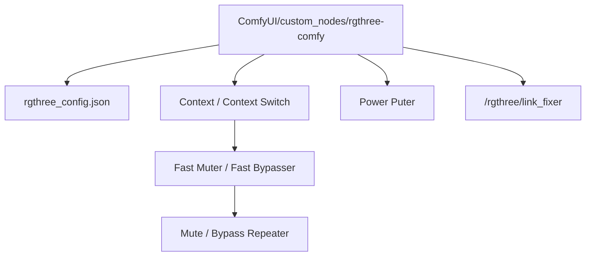

# rgthree/rgthree-comfy

> Collection de nœuds pour ComfyUI qui nettoie les workflows et évite le calcul inutile.

## Le problème
Un workflow ComfyUI qui grossit devient un plat de spaghettis, et les aiguillages classiques
laissent tourner les branches qu'on croyait coupées : du GPU brûlé pour rien.

## Ce que ça fait vraiment
Fournit un `Context` / `Context Switch` qui fait passer le premier contexte non vide, un
`Fast Muter` / `Fast Bypasser` servant de tableau de bord pour couper des nœuds ou des groupes
d'un clic, un `Power Lora Loader` qui empile plusieurs LoRA dans un seul nœud, et un
`Power Puter` qui évalue des expressions multi-lignes pour produire un entier, un flottant, une
chaîne ou un booléen. Ajoute aussi une barre de progression, l'exécution des seuls nœuds de
sortie sélectionnés, et un correcteur de liens cassés servi sur `/rgthree/link_fixer`.

## Comment c'est branché


## Essayer
```bash
cd ComfyUI/custom_nodes
git clone https://github.com/rgthree/rgthree-comfy.git
```
Puis démarrer ComfyUI. Réglages par clic droit sur le fond du graphe, `rgthree-comfy > Settings`.

## Coût et pièges
Gratuit, sans clé ni service tiers, mais dépend entièrement de ComfyUI : l'auteur prévient
qu'un changement de ComfyUI peut casser l'extension, d'où l'interrupteur par fonctionnalité.

## Ce que ce n'est pas
Ce n'est pas un projet d'équipe : l'auteur écrit l'avoir fait pour ses propres usages. Ce n'est
pas une couche de compatibilité universelle — plusieurs nœuds sont marqués dépréciés ou
expérimentaux, et certaines fonctions sont désactivées par défaut. Le README ne déclare
aucune licence.

## Alternatives
- ComfyUI seul — la version récente a corrigé la récursion d'exécution que ce dépôt compensait.
- `Power Lora Loader` remplace le `Lora Loader Stack` du même dépôt, déprécié.

## Pour toi
À connaître si tu touches à ComfyUI ; hors de ça, aucun apport pour une chaîne data ou MLOps.
