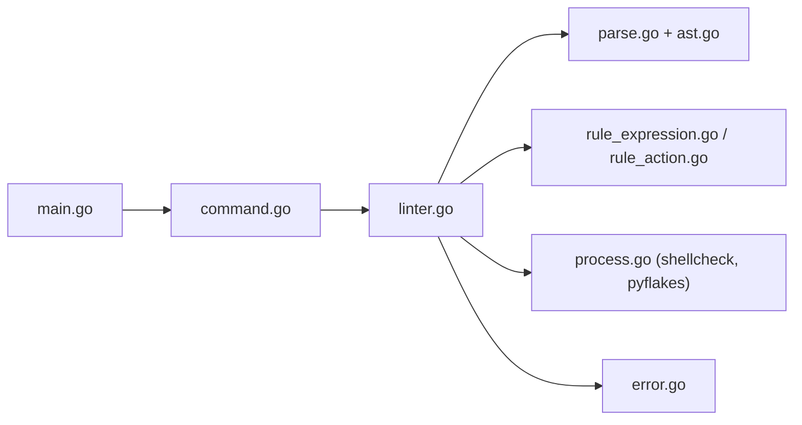

# rhysd/actionlint

> Vérificateur statique de fichiers de workflow GitHub Actions, avec contrôle de types des expressions.

## Le problème
Une faute de clé, une expression `${{ }}` mal typée ou une injection de script ne se découvre qu'à l'exécution du workflow, après des cycles de push.

## Ce que ça fait vraiment
Lit les YAML de `.github/workflows`, les parse en AST et applique des règles : syntaxe, types des expressions, entrées et sorties des actions, workflows réutilisables, injection par entrées non fiables, secrets en dur, globs, `needs:`, labels de runners, cron. Peut appeler shellcheck et pyflakes sur les `run:`. Le README montre un exemple de workflow avec 7 erreurs détectées.

## Comment c'est branché


## Essayer
```bash
go install github.com/rhysd/actionlint/cmd/actionlint@latest
actionlint
```

## Coût et pièges
Gratuit. Un playground en ligne tourne en WebAssembly dans le navigateur. Les labels de runners auto-hébergés se déclarent dans `actionlint.yaml`.

## Ce que ce n'est pas
Ne vérifie pas le comportement réel des actions ni des secrets côté GitHub. 190 issues ouvertes, dont des faux positifs possibles.

## Alternatives
Aucune alternative nommée dans le README (reviewdog, super-linter et pre-commit y figurent comme intégrations).

## Pour toi
À adopter : tes pipelines CI et de déploiement ML tiennent à ces workflows, et un linter local, gratuit et éprouvé évite des allers-retours de push.

