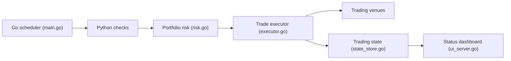

# richkuo/go-trader

> Bot de trading de cryptos et de produits dérivés, planificateur Go qui lance des stratégies Python, en paper ou live.

## Le problème
Exécuter de nombreuses stratégies sur plusieurs plates-formes avec gestion du risque demande beaucoup de code d'orchestration.

## Ce que ça fait vraiment
Un démon Go lance à chaque cycle de courts scripts Python, reçoit des signaux JSON, exécute les ordres en paper ou live, applique des limites (arrêt à drawdown, pertes quotidiennes, stops ATR) et garde l'état dans SQLite. Plates-formes : Binance US, Deribit, IBKR, Hyperliquid, TopStep, Robinhood, OKX, Luno. Alertes Discord/Telegram, tableau de bord local, mise à jour sur simple « yes » en message privé.

## Comment c'est branché


## Essayer
```bash
git clone https://github.com/richkuo/go-trader.git && cd go-trader
uv sync
cd scheduler && go build -o ../go-trader . && cd ..
./go-trader init
./go-trader --config scheduler/config.json --once
sudo bash scripts/install-service.sh
```

## Coût et pièges
Clés d'échange et jetons Discord à fournir ; le mode live engage de l'argent réel. L'auto-mise-à-jour se déclenche sur réponse à un message privé. Le README conseille de donner SKILL.md à un agent pour l'installation.

## Ce que ce n'est pas
Pas une promesse de rentabilité : le README précise que ce n'est pas un conseil financier. Les stratégies anciennes sont signalées sans avantage après audit des frais.

## Alternatives
Aucune alternative nommée dans le README.

## Pour toi
À ignorer : risque financier réel et code de trading peu auditable ; seule l'architecture daemon Go + scripts Python éphémères mérite un coup d'œil.

