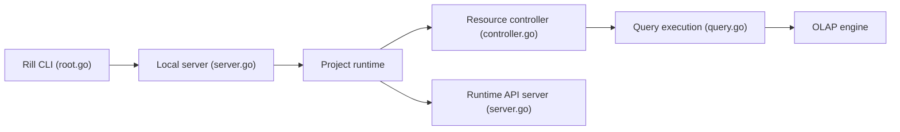

# rilldata/rill

> Outil de BI as code (YAML + SQL) sur ClickHouse ou DuckDB, pensé pour agents et analystes.

## Le problème
Les dashboards BI se construisent en clics, difficiles à versionner et à faire écrire par un agent de code.

## Ce que ça fait vraiment
Tu décris modèles SQL, vues de métriques (dimensions, mesures) et dashboards en YAML. Rill Developer les exécute en local sur DuckDB ou ClickHouse ; `rill deploy` les pousse sur Rill Cloud, qui ajoute BI conversationnelle, serveur MCP, alertes et rapports. `rill init` peut générer des instructions pour Claude ou d'autres agents.

## Comment c'est branché


## Essayer
```bash
curl https://rill.sh | sh
rill start my-project
rill init
rill deploy
```

## Coût et pièges
Le local est gratuit ; les fonctions cloud (MCP hébergé, alertes, déploiement) passent par Rill Cloud, offre à compte. Les gros volumes demandent ClickHouse.

## Ce que ce n'est pas
Pas un outil de visualisation libre-service sans code : tout est défini en fichiers. Le README ne documente pas les tarifs du cloud.

## Alternatives
Aucune alternative nommée dans le README.

## Pour toi
À surveiller : l'approche BI-as-code avec couche sémantique parle à un profil data, mais la valeur complète dépend du cloud payant.

