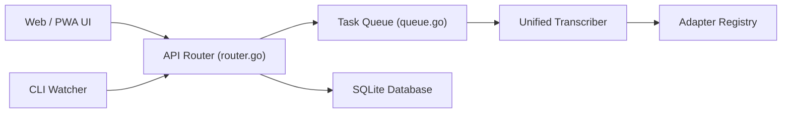

# rishikanthc/Scriberr

> Application de transcription audio auto-hébergée et hors ligne, avec diarisation et chat avec les transcriptions.

## Le problème
Les services de transcription envoient l'audio à un cloud et facturent à l'heure.

## Ce que ça fait vraiment
On téléverse ou on enregistre de l'audio dans une interface web (PWA). Des modèles locaux (Whisper, NVIDIA Parakeet et Canary) transcrivent avec horodatage par mot, et la diarisation étiquette les locuteurs. Un dossier surveillé traite les nouveaux fichiers. Résumés et chat passent par Ollama ou une API compatible OpenAI.

## Comment c'est branché


## Essayer
```bash
brew tap rishikanthc/scriberr
brew install scriberr
scriberr
docker compose up -d
docker compose -f docker-compose.cuda.yml up -d
```

## Coût et pièges
Gratuit. Premier démarrage long (téléchargement des modèles). Un GPU NVIDIA accélère fortement ; les RTX 50 exigent une image dédiée. En HTTP simple, il faut `SECURE_COOKIES=false`.

## Ce que ce n'est pas
Pas totalement hors ligne si tu actives le chat via OpenAI. L'auteur a eu des pauses de développement, puis a annoncé la reprise.

## Alternatives
Aucune alternative nommée dans le README.

## Pour toi
À adopter pour transcrire des réunions en privé sur ton propre serveur : c'est concret et local, avec le risque d'un mainteneur unique.

