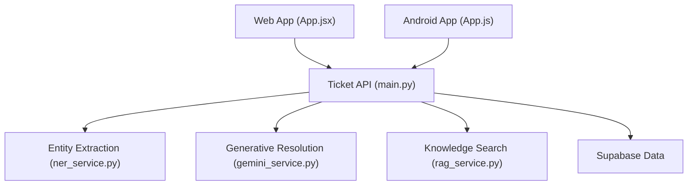

# ritesh-1918/HELPDESK.AI

> Helpdesk multi-entreprises qui classe les tickets IT par IA et suggère des corrections ; web et Android.

## Le problème
Le tri manuel des tickets IT (catégorie, priorité, doublons) ralentit le support de premier niveau.

## Ce que ça fait vraiment
Création de tickets avec classification (DistilBERT annoncé), extraction d'entités (hostnames, IP, numéros de série), détection de doublons, OCR et résolution générative via GitHub Models/Gemini. Quatre niveaux de droits, multi-tenant via Supabase (RLS). Les chiffres « millisecondes » et « 100 % des tickets » sont des affirmations du README, non mesurées.

## Comment c'est branché


## Essayer
```bash
git clone https://github.com/ritesh-1918/HELPDESK.AI.git
cd HELPDESK.AI/Frontend
npm install
npm run dev
# .env du dossier /Frontend : VITE_SUPABASE_URL, VITE_SUPABASE_ANON_KEY, VITE_STRIPE_GROWTH_LINK, VITE_BACKEND_URL
```

## Coût et pièges
Projet Supabase à créer, backend FastAPI à lancer (commande non documentée), accès à GitHub Models/Gemini. Le README ne détaille que le frontend.

## Ce que ce n'est pas
Pas une solution clés en main : le démarrage du backend et l'entraînement/chargement des modèles ne sont pas documentés. 180 issues ouvertes.

## Alternatives
Aucune alternative nommée dans le README.

## Pour toi
Surveiller : exemple de pipeline NLP + LLM pour du ticketing, à lire pour l'architecture, pas à déployer faute de doc backend.

