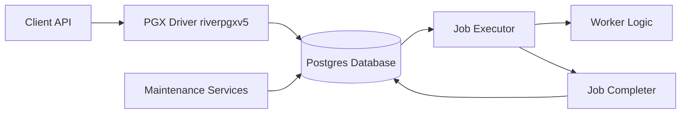

# riverqueue/river

> File de jobs en Go adossée à Postgres, avec mise en file transactionnelle.

## Le problème
Une file séparée (Redis, broker) désynchronise jobs et données : un job peut partir alors que la transaction a échoué.

## Ce que ça fait vraiment
Jobs définis par une paire `JobArgs` / `Worker`, identifiés par un « kind ».
`InsertTx` insère le job dans la même transaction que les données : visible seulement au commit.
Files multiples, jobs planifiés et périodiques, uniques, snooze, annulation, insertion par lots (`COPY FROM`).
Services de maintenance (nettoyage, sauvetage), élection de leader, UI web séparée ; insertion depuis Python et Ruby.

## Comment c'est branché

## Essayer
Aucune commande shell dans le README : exemples de code Go (`river.NewClient`, `InsertTx`) et renvoi à la doc.

## Coût et pièges
Gratuit ; nécessite Postgres. MPL-2.0 (copyleft faible).

## Ce que ce n'est pas
Pas un orchestrateur de workflows ni une file multi-langage : les jobs s'exécutent en Go, les autres langages ne font qu'insérer.

## Alternatives
Inspirations citées, non comparées : Oban (Elixir), Sidekiq, Que, GoodJob (Ruby), Hangfire (.NET).

## Pour toi
À ignorer côté Python : excellent si ton backend est en Go sur Postgres, sinon aucun point d'entrée pour un pipeline data.
