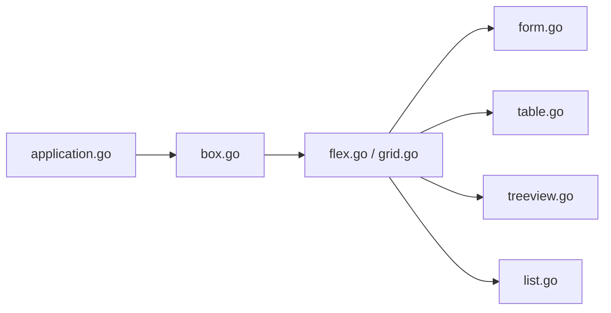

# rivo/tview

> Bibliothèque Go de widgets pour interfaces terminal : formulaires, tableaux, arbres, listes.

## Le problème
Construire une interface terminal interactive en Go à partir de zéro demande de gérer écran, focus et mise en page.

## Ce que ça fait vraiment
Fournit des composants : formulaires (champs, cases, boutons), zone de texte, vue texte colorée navigable, tableau, arbre, liste, image, mise en page grille/flex/pages, fenêtres modales, enveloppe `Application`. Repose sur tcell et uniseg. Très personnalisable et extensible. Cité par de nombreux projets (K9s, gh, lazysql…).

## Comment c'est branché


## Essayer
```bash
go get github.com/rivo/tview@master
```
```go
box := tview.NewBox().SetBorder(true).SetTitle("Hello, world!")
if err := tview.NewApplication().SetRoot(box, true).Run(); err != nil {
    panic(err)
}
```

## Coût et pièges
Gratuit. Compatibilité ascendante recherchée mais pas garantie (changements de tcell, corrections de bogues, interfaces internes comme `Primitive`). Mainteneur unique.

## Ce que ce n'est pas
Pas un framework graphique : exclusivement terminal.

## Alternatives
Aucune alternative nommée dans le README.

## Pour toi
Solide pour écrire un outil d'exploitation en terminal (dashboards MLOps, navigateurs de logs) si tu pratiques Go ; sinon hors périmètre.

