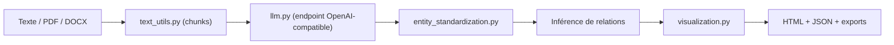

# robert-mcdermott/ai-knowledge-graph

> Transforme un texte en graphe de connaissances interactif par extraction de triplets avec un LLM.

## Le problème
Un long document reste illisible ; voir ses entités et leurs relations, avec la phrase source, demande de tout extraire à la main.

## Ce que ça fait vraiment
Découpe le texte en chunks, fait extraire par un LLM des triplets sujet-prédicat-objet typés (avec la phrase d'origine), fusionne les variantes d'entités, ajoute des relations inférées (marquées et plafonnées), calcule des communautés (Louvain) et produit une page HTML autonome. Exports JSON, CSV, GraphML, Cypher Neo4j. Commandes optionnelles `graph-chat` (questions sur le graphe) et `graph-serve` (interface locale). Fonctionne avec tout endpoint compatible OpenAI, Ollama compris. Cache disque des réponses.

## Comment c'est branché


## Essayer
```bash
git clone https://github.com/robert-mcdermott/ai-knowledge-graph.git
cd ai-knowledge-graph
uv sync --extra web
uv run graph-serve --config config.toml --graphs data/samples --open
uv run generate-graph --input your_text_file.txt --output knowledge_graph.html
uv run graph-chat knowledge_graph.json "How did the steam engine change cities?"
```

## Coût et pièges
Gratuit avec un Ollama local ; facturé si tu pointes vers OpenAI ou Gemini. Les modèles de raisonnement peuvent épuiser `max_tokens` (prévoir 16-32k). `graph-serve` n'a aucune authentification : local uniquement. 170 tests sans LLM.

## Ce que ce n'est pas
Pas une base de graphes : la sortie est un fichier statique. L'inférence par règles (transitive, lexicale) est désactivée par défaut car bruyante.

## Alternatives
Non documenté dans le README.

## Pour toi
Adopter : exemples testables sans LLM, traçabilité des triplets et exports vers Neo4j ; c'est un bon banc pour l'extraction d'entités.
