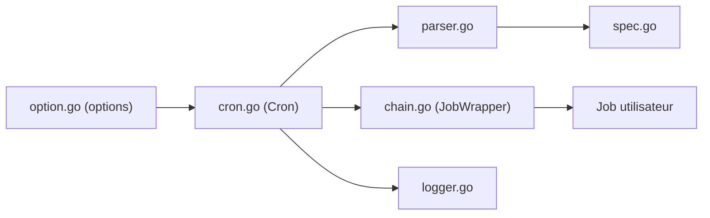

# robfig/cron

> Bibliothèque Go de planification de tâches à la syntaxe cron, dans ses versions 1, 2 et 3.

## Le problème
Exécuter du code Go à intervalles réguliers avec une syntaxe cron, en gérant fuseaux horaires et tâches qui se chevauchent.

## Ce que ça fait vraiment
On construit un objet `Cron` avec des options fonctionnelles, on lui ajoute des tâches avec une expression cron (format standard par défaut, secondes en option pour le style Quartz). Des « chaînes » (`Chain`, `JobWrapper`) ajoutent des comportements : récupérer les paniques, retarder ou sauter une exécution si la précédente n'est pas finie, journaliser. Le fuseau se fixe par `CRON_TZ`. La journalisation suit l'interface `logr`.

## Comment c'est branché


## Essayer
```bash
go get github.com/robfig/cron/v3@v3.0.0
```
Puis `import "github.com/robfig/cron/v3"`. Pour garder le champ secondes de la v1 : `cron.New(cron.WithSeconds())`.

## Coût et pièges
Gratuit. Le dernier push date de juillet 2024, avec 173 issues ouvertes. La v3 casse la compatibilité avec v1 et v2 : champ des secondes retiré par défaut, plus de récupération automatique des paniques, options passées à la construction.

## Ce que ce n'est pas
Pas un ordonnanceur distribué ni persistant : les tâches vivent dans le processus et se perdent au redémarrage. Pas un outil de workflow de données.

## Alternatives
Le README ne nomme aucune alternative ; il cite seulement le format cron standard et celui de Quartz.

## Pour toi
Ignorer : bibliothèque Go sans usage direct en data/IA/MLOps, et sans mise à jour depuis plus d'un an ; à réserver à un service Go qui a besoin d'un cron interne simple.

