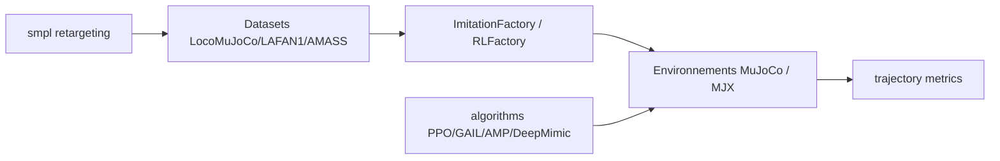

# robfiras/loco-mujoco

> Banc d'essai d'apprentissage par imitation pour le contrôle du corps entier de robots et de modèles humains.

## Le problème
Comparer des algorithmes d'imitation sur humanoïdes et quadrupèdes suppose de retrouver, adapter et rejouer les mêmes données de capture de mouvement.

## Ce que ça fait vraiment
Environnements MuJoCo (un seul) et MJX/MjWarp (parallèles, sur GPU) : 12 humanoïdes, 4 quadrupèdes, 4 modèles biomécaniques. Plus de 22 000 échantillons de mocap (LocoMuJoCo, LAFAN1, AMASS) retargetés par robot, des algorithmes JAX en un fichier (PPO, GAIL, AMP, DeepMimic), des métriques de comparaison de trajectoires, une interface Gymnasium et de la randomisation de domaine.

## Comment c'est branché


## Essayer
```bash
cd loco-mujoco
pip install -e .
pip install jax["cuda12"]
loco-mujoco-set-all-caches --path "$HOME/.loco-mujoco-caches"
```

## Coût et pièges
Gratuit. Jax est installé en version CPU par défaut ; un GPU est nécessaire pour MJX. AMASS s'installe à part pour ses conditions de licence, et MyoSkeleton demande `loco-mujoco-myomodel-init` pour accepter sa licence.

## Ce que ce n'est pas
Pas un simulateur généraliste : un banc d'essai d'imitation. Le paquet PyPI n'est pas proposé (installation depuis un clone).

## Alternatives
Aucune alternative nommée dans le README.

## Pour toi
À surveiller : référence utile pour du RL et de l'imitation en JAX, si la robotique t'intéresse ; sinon sans objet.
