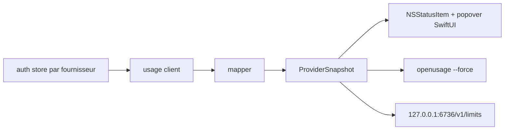

# robinebers/openusage

> Application macOS de barre de menus qui affiche la consommation de tes abonnements de codage IA.

## Le problème
Chaque fournisseur d'IA a son propre écran de quota, et aucun ne dit où tu en es globalement.
On découvre la limite atteinte en pleine session.

## Ce que ça fait vraiment
Un popover groupé par fournisseur : limites de session et hebdomadaires, crédits, dépenses, comptes à rebours.
Jusqu'à deux métriques épinglées par fournisseur directement dans la barre de menus.
Une CLI `openusage` qui rend un JSON stable via le même cache de cinq minutes, sans que l'app tourne.
Une API HTTP locale sur `127.0.0.1:6736/v1/limits`, en boucle locale, qui ne sert jamais d'identifiants.

## Comment c'est branché


## Essayer
```sh
brew install --cask openusage
```

## Coût et pièges
Gratuit, mais macOS 15 (Sequoia) minimum : rien pour Linux ni Windows.
L'API locale est lisible par n'importe quelle page de navigateur ouverte ; des dSYM partent vers PostHog côté build.

## Ce que ce n'est pas
Pas un contrôleur de dépense : il lit et affiche, il ne bloque rien.
Pas multiplateforme, malgré l'universalité du binaire Apple Silicon/Intel.
Les dollars affichés sont des estimations à partir de tarifs rafraîchis, pas ta facture.

## Alternatives
Aucune alternative nommée dans le README.

## Pour toi
Tu es sous WSL2 : inutilisable tel quel. À noter seulement pour l'idée de l'API locale de quotas.
