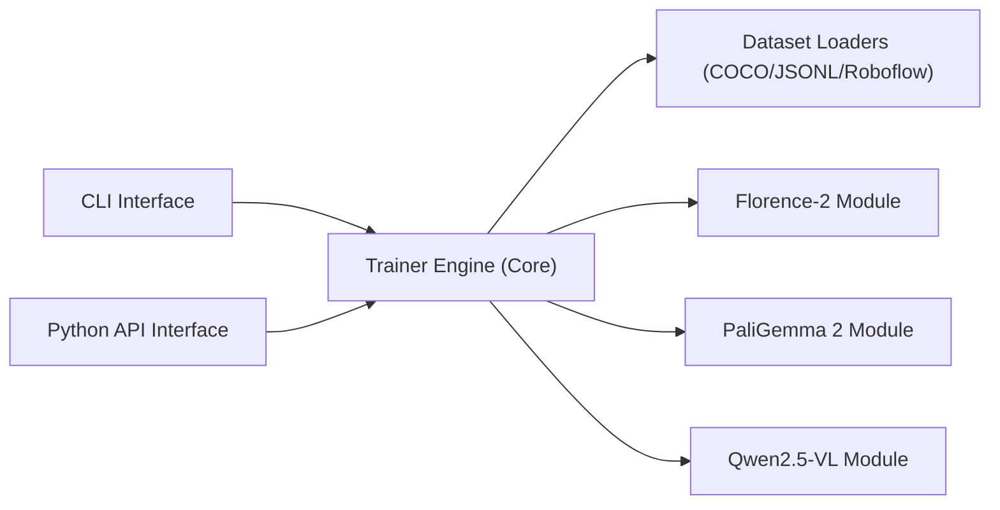

# roboflow/maestro

> Recettes pour affiner des modèles vision-langage (Florence-2, PaliGemma 2, Qwen2.5-VL), pour ingénieurs ML.

## Le problème
Le fine-tuning multimodal demande de recoller configuration, chargement de données, reproductibilité et boucle d'entraînement pour chaque modèle.

## Ce que ça fait vraiment
Une CLI et une API Python lancent un entraînement par modèle avec LoRA ou QLoRA ; un module commun gère jeux COCO/JSONL/Roboflow, callbacks, graine, métriques et journal. Quatre notebooks Colab (détection, extraction JSON). Dépendances par modèle, à isoler dans des environnements séparés.

## Comment c'est branché


## Essayer
```bash
pip install "maestro[paligemma_2]"
maestro paligemma_2 train \
  --dataset "dataset/location" \
  --epochs 10 \
  --batch-size 4 \
  --optimization_strategy "qlora" \
  --metrics "edit_distance"
```

## Coût et pièges
Un GPU est nécessaire (Colab possible pour les cookbooks). Les dépendances des modèles peuvent se contredire : un environnement par modèle. Certaines recettes sont marquées expérimentales.

## Ce que ce n'est pas
Pas un framework généraliste d'entraînement : trois familles de modèles. Le README ne détaille ni prérequis matériels ni résultats.

## Alternatives
Aucune alternative nommée dans le README.

## Pour toi
À surveiller : point de départ propre pour affiner un VLM sur tes données, mais couverture limitée à trois modèles.
