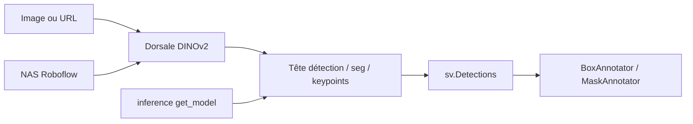

# roboflow/rf-detr

> Détection d'objets, segmentation d'instances et points clés en temps réel, architecture transformer.

## Le problème
Les détecteurs temps réel performants sont majoritairement sous AGPL-3.0, ce qui contamine tout produit
propriétaire ; les alternatives permissives perdent en précision à latence égale.

## Ce que ça fait vraiment
Architecture DETR temps réel bâtie sur une dorsale ViT DINOv2, avec une API unique pour détection,
segmentation d'instances et points clés (préversion). Six tailles de N à 2XL, issues d'une recherche
d'architecture neuronale. Le paquet `rfdetr` et les modèles N/S/M/L sont sous **Apache 2.0** ;
XL et 2XL passent par l'extension `rfdetr_plus` sous PML 1.0. Toutes les tailles de segmentation sont
Apache 2.0. Mesures COCO faites en interne sur les 5 000 images de `val2017`, latences sur NVIDIA T4
en TensorRT FP16, batch 1.

## Comment c'est branché


## Essayer
```bash
pip install rfdetr
pip install rfdetr[plus]
pip install https://github.com/roboflow/rf-detr/archive/refs/heads/develop.zip
```

## Coût et pièges
Python 3.10 minimum. Les tailles XL et 2XL relèvent de la licence PML 1.0, pas d'Apache : usage
commercial à vérifier. `COCO_CLASSES` ne vaut que pour les modèles pré-entraînés COCO ; sur un modèle
affiné il faut `detections.data["class_name"]`. L'entraînement passe par Colab ou la plateforme Roboflow.

## Ce que ce n'est pas
Pas entièrement permissif : le cœur l'est, les plus gros modèles non.
Les points clés sont en **préversion**. Les chiffres cités ne sont pas ceux des auteurs concurrents mais
des mesures maison, sauf lignes marquées † — comparables entre elles, pas forcément aux publications.

## Alternatives
- **YOLO11 / YOLO26** : plus légers en paramètres, mais AGPL-3.0.
- **LW-DETR** : Apache 2.0, comparable en latence.
- **D-FINE** : Apache 2.0, bon compromis précision/latence.

## Pour toi
Le détecteur à essayer quand l'AGPL de YOLO bloque un projet client.
