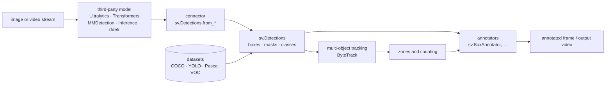

# roboflow/supervision

> **The plumbing around a vision model: normalised outputs, drawing, tracking, zones, datasets.**

## The problem

Every detection model returns its results in its own shape, and everything that happens next
— drawing boxes, following an object across frames, counting what crosses into a zone,
reading a COCO or YOLO dataset back — gets rewritten by hand in every project, in OpenCV,
roughly, and never twice the same way.

## What it actually does

Supervision calls itself model agnostic: it runs no inference of its own. It provides
`sv.Detections`, one structure for boxes, masks and classes, plus **connectors** that pour
the outputs of common libraries into it — Ultralytics, Transformers, MMDetection, Inference
(`sv.Detections.from_inference(result)`). Some, such as `rfdetr`, already return an
`sv.Detections` directly.

On top of that structure the library ships three families of tools:

1. **annotators** (`sv.BoxAnnotator` and others), composed over an image: each takes
   `scene=` and `detections=` and returns the annotated frame;
2. **dataset utilities**: `sv.DetectionDataset.from_coco / from_yolo / from_pascal_voc`,
   images loaded on demand, `split`, `merge`, then writing back with `as_yolo /
   as_pascal_voc / as_coco` — which also covers converting one format into another;
3. **real-time zone counting**, named in the README's opening line as the far end of the
   chain, from data loading to counting on a stream.

The featured tutorials (dwell time in a zone, speed estimation with YOLO and ByteTrack) show
the intended use: third-party detection, multi-object tracking, filtering, perspective
transformation, visualisation.

## How it is wired



No code-derived diagram exists for this repository: the graph above is rebuilt from the
README alone and names no file inside the repo.

## Try it

```bash
pip install supervision
pip install pillow rfdetr   # optional dependencies for the README example
```

```python
import supervision as sv
from PIL import Image
from rfdetr import RFDETRSmall

image = Image.open("path/to/image.jpg")
model = RFDETRSmall()
detections = model.predict(image, threshold=0.5)

len(detections)
# 5
```

Conda, mamba and source installs are deferred to the online guide; the README gives no
command for them.

## Cost and traps

The library is MIT and asks for no key and no account: `pip install supervision` in a
**Python >= 3.10** environment is the whole story. The cost sits elsewhere, on the paths that
go through the Roboflow platform:

- the `inference` connector requires a **Roboflow API key**, therefore an account — the
  README says so and links to the authentication docs;
- the dataset example downloads through the `roboflow` SDK with a `WORKSPACE_ID` and a
  `PROJECT_ID`, i.e. a project hosted by the vendor.

Nothing forces those paths — Ultralytics, Transformers, MMDetection or `rfdetr` will do,
locally — but they are the README's natural slope. What a GPU costs, and whether the
advertised real-time counting needs one, is not documented: that depends on the model you
pick, not on this library.

## What it is not

- **Not a model, and not a trainer.** No detection comes out of Supervision: it receives the
  outputs of a model installed next to it and processes them. With no model, `sv.Detections`
  stays empty. This is the central misunderstanding.
- **Not an OpenCV replacement**: the examples read the image with `cv2.imread` and hand the
  `scene` to the annotators. Supervision sits on top.
- **Not an application or a service**: no interface, no server, no pipeline to launch. These
  are blocks to assemble in your own code.

## Alternatives

| | When to prefer it |
|---|---|
| **ultralytics/ultralytics** | When you need the model itself — training, inference, YOLO weights. It is a supplier of `sv.Detections`, not a competitor: the two are used together. |
| **ultralytics/yolov5** | Same detector role, earlier generation: keep it if an existing project already depends on it, otherwise there is nothing there for post-processing. |
| **JaidedAI/EasyOCR** | Different domain (text reading): prefer it when the need is extracting characters, not tracking and counting objects. |

`keras-team/keras` is not comparable: it is a general training framework, not a vision
post-processing layer.

## For you

Worth adopting as soon as a vision task outgrows the demo notebook: this is exactly the
throwaway code that gets rewritten badly — output conversion, drawing, tracking, counting,
COCO/YOLO/VOC round-trips — and handing it to an MIT library with 50k stars, pushed into
2026, is a net gain. Read it at minimum for the `sv.Detections` structure, which is a sound
exchange format even outside the library. Plug in a local model rather than the `inference`
connector, so you do not drag an account dependency where none is needed.
