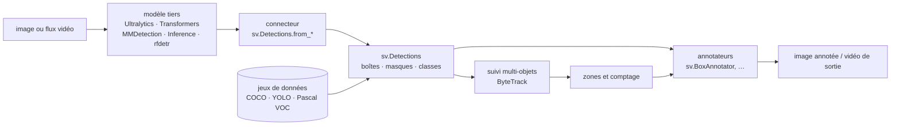

# roboflow/supervision

> **La plomberie autour d'un modèle de vision : sorties normalisées, dessin, suivi, zones, jeux de données.**

## Le problème

Chaque modèle de détection rend ses résultats dans son propre format, et tout ce qui vient
après — dessiner des boîtes, suivre un objet d'une image à l'autre, compter ce qui entre dans
une zone, relire un jeu de données COCO ou YOLO — se réécrit à la main à chaque projet, en
OpenCV, à peu près, et jamais deux fois pareil.

## Ce que ça fait vraiment

Supervision se dit *model agnostic* : elle n'infère rien elle-même. Elle fournit
`sv.Detections`, une structure unique pour des boîtes, masques et classes, et des
**connecteurs** qui y versent les sorties des bibliothèques courantes — Ultralytics,
Transformers, MMDetection, Inference (`sv.Detections.from_inference(result)`). Certaines,
comme `rfdetr`, rendent déjà un `sv.Detections` directement.

À partir de cette structure, la bibliothèque donne trois familles d'outils :

1. **des annotateurs** (`sv.BoxAnnotator` et les autres) qu'on compose sur une image, chacun
   prenant `scene=` et `detections=` et rendant l'image annotée ;
2. **des utilitaires de jeux de données** : `sv.DetectionDataset.from_coco / from_yolo /
   from_pascal_voc`, chargement des images à la demande, `split`, `merge`, puis réécriture
   avec `as_yolo / as_pascal_voc / as_coco` — donc aussi la conversion d'un format à l'autre ;
3. **le comptage par zones en temps réel**, annoncé dès l'ouverture du README comme l'autre
   bout de la chaîne, du chargement de données au comptage sur flux.

Les tutoriels mis en avant (temps de présence dans une zone, estimation de vitesse avec YOLO
et ByteTrack) montrent l'usage visé : détection tierce, suivi multi-objets, filtrage,
transformation de perspective, visualisation.

## Comment c'est branché



Aucun diagramme tiré du code n'existe pour ce dépôt : ce schéma est reconstruit depuis le
seul README, sans nommer de fichier du dépôt.

## Essayer

```bash
pip install supervision
pip install pillow rfdetr   # dépendances optionnelles de l'exemple du README
```

```python
import supervision as sv
from PIL import Image
from rfdetr import RFDETRSmall

image = Image.open("path/to/image.jpg")
model = RFDETRSmall()
detections = model.predict(image, threshold=0.5)

len(detections)
# 5
```

Conda, mamba et l'installation depuis les sources sont renvoyés au guide en ligne, sans
commande donnée dans le README.

## Coût et pièges

La bibliothèque est sous MIT et ne demande ni clé ni compte : `pip install supervision` dans
un environnement **Python >= 3.10**, c'est tout. Le coût est ailleurs, dans les chemins qui
passent par la plateforme Roboflow :

- le connecteur `inference` exige une **clé d'API Roboflow**, donc un compte — le README le
  dit explicitement et renvoie à la doc d'authentification ;
- l'exemple de jeux de données télécharge par le SDK `roboflow` avec un `WORKSPACE_ID` et un
  `PROJECT_ID`, c'est-à-dire un projet hébergé chez l'éditeur.

Rien n'oblige à emprunter ces chemins — Ultralytics, Transformers, MMDetection ou `rfdetr`
suffisent, en local — mais c'est la pente naturelle du README. Ce qu'un GPU coûte, et si le
temps réel annoncé en demande un, n'est pas documenté : cela dépend du modèle choisi, pas de
la bibliothèque.

## Ce que ce n'est pas

- **Ce n'est pas un modèle, et pas un entraîneur de modèles.** Aucune détection ne sort de
  Supervision : elle reçoit les sorties d'un modèle installé à côté et les traite. Sans
  modèle, `sv.Detections` reste vide. C'est le malentendu central.
- **Ce n'est pas un remplaçant d'OpenCV** : les exemples lisent l'image avec `cv2.imread` et
  passent la `scene` aux annotateurs. Supervision se pose au-dessus.
- **Ce n'est pas une application ni un service** : pas d'interface, pas de serveur, pas de
  pipeline prêt à lancer. Ce sont des briques à assembler dans son propre code.

## Alternatives

| | Quand le préférer |
|---|---|
| **ultralytics/ultralytics** | Quand il faut le modèle lui-même — entraînement, inférence, poids YOLO. C'est un fournisseur de `sv.Detections`, pas un concurrent : les deux s'utilisent ensemble. |
| **ultralytics/yolov5** | Même rôle de détecteur, génération précédente : à garder si un projet existant en dépend déjà, sinon rien à y chercher côté post-traitement. |
| **JaidedAI/EasyOCR** | Autre domaine (lecture de texte) : à préférer si le besoin est d'extraire des caractères, pas de suivre et compter des objets. |

`keras-team/keras` n'est pas comparable : c'est un cadre d'entraînement généraliste, pas une
couche de post-traitement vision.

## Pour toi

À adopter dès qu'un sujet vision dépasse le notebook de démo : c'est exactement le code
jetable qu'on réécrit mal — conversion des sorties, dessin, suivi, comptage, allers-retours
COCO/YOLO/VOC — et le rendre à une bibliothèque MIT de 50 k étoiles, poussée jusqu'en 2026,
est un gain net. À lire au minimum pour la structure `sv.Detections`, qui est un bon format
d'échange même hors de la bibliothèque. Garder en tête de brancher un modèle local plutôt que
le connecteur `inference`, pour ne pas ramener une dépendance de compte là où il n'en faut pas.
