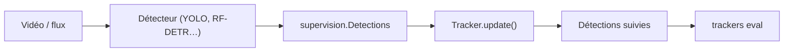

# roboflow/trackers

> Bibliothèque Python de suivi d'objets (SORT, ByteTrack, OC-SORT, BoT-SORT, C-BIoU, McByte) compatible supervision.

## Le problème
Les identités d'objets se perdent avec occlusions, mouvements rapides ou caméra mobile ; réimplémenter les algorithmes est long.

## Ce que ça fait vraiment
Six trackers réimplémentés depuis les articles, avec une interface commune `update(detections, frame=None)` sur `supervision.Detections`. CLI `trackers track`, `eval` (CLEAR, HOTA, Identity) et `download` (MOT17, SportsMOT), réglage Optuna via `trackers[tune]`. Résultats de référence sur quatre jeux.

## Comment c'est branché


## Essayer
```bash
pip install trackers
trackers track \
    --source video.mp4 \
    --output.video output.mp4 \
    --detection.model rfdetr-medium \
    --tracker bytetrack \
    --show.labels \
    --show.trajectories
```

## Coût et pièges
Détecteur à fournir (`inference` non inclus). McByte exige torch, SAM et Cutie. Les jeux MOT17 sont CC BY-NC-SA : usage non commercial.

## Ce que ce n'est pas
Les branches d'apparence/ReID des articles ne sont pas incluses. Le bloc d'architecture fourni décrit un autre projet (passerelle LLM « New API ») : écarté.

## Alternatives
- BoxMOT : sous AGPL-3.0, cité par le README comme option copyleft.

## Pour toi
À adopter si tu fais de la vision par ordinateur : licence Apache-2.0 et interface unique facilitent la comparaison d'algorithmes.

