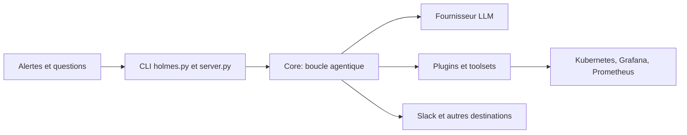

# robusta-dev/holmesgpt

> Agent IA open source qui enquête sur les incidents de production et cherche la cause racine.

## Le problème
Face à une alerte, un SRE doit fouiller logs, métriques et traces dans dix outils avant de comprendre.

## Ce que ça fait vraiment
Une boucle d'agent interroge en direct des sources (Prometheus, Grafana, Datadog, Kubernetes, Loki, Tempo, bases SQL, MongoDB, Kafka, ArgoCD, GitHub, etc.) via des « toolsets », puis écrit l'analyse vers Slack, Jira, PagerDuty ou OpsGenie. Le mode opérateur tourne en arrière-plan sous Kubernetes pour des contrôles de santé planifiés. Accès en lecture seule et respect des droits RBAC.

## Comment c'est branché

## Essayer
Le README renvoie à la documentation d'installation et aux guides d'usage : aucune commande n'y figure.

## Coût et pièges
Fonctionne avec n'importe quel fournisseur LLM (OpenAI, Anthropic, Azure, Bedrock, Gemini…) : tokens à ta charge. Les intégrations demandent des accès aux systèmes d'observabilité.

## Ce que ce n'est pas
Pas un outil de remédiation autonome par défaut : l'accès est en lecture seule. Le mode opérateur et l'ouverture de PR exigent des intégrations supplémentaires. Ne pas confondre avec Robusta, la plateforme d'origine.

## Alternatives
- Robusta : la plateforme d'origine, qui apporte l'intégration Slack et Teams.

## Pour toi
À surveiller : pertinent en MLOps pour accélérer le diagnostic, projet CNCF sandbox, mais licence non déclarée au catalogue.
