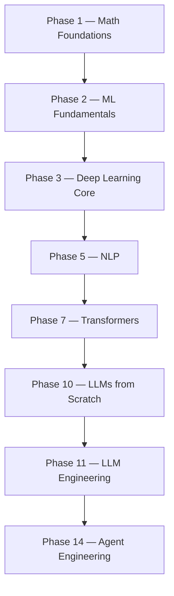

# rohitg00/ai-engineering-from-scratch

> Cursus ouvert de 523 leçons pour construire l'IA à la main, des maths aux agents.

## Le problème
La matière disponible est éparpillée : un papier ici, un billet de fine-tuning là. On livre un chatbot sans savoir lire sa courbe de perte.

## Ce que ça fait vraiment
20 phases empilées, 523 leçons, ~342 heures, en Python, TypeScript, Rust et Julia. Chaque leçon suit six temps, dont un couple **Build It / Use It** : on implémente l'algorithme à partir des maths brutes, puis on refait la même chose avec la bibliothèque de production. Chaque leçon produit un artefact réutilisable : un prompt, un skill, un agent ou un serveur MCP. Des skills de tutorat (`start-learning`, `learn`, `course-guide`, `learn-mcp`, `learn-agent-skills`, `claude-certification`) pilotent la progression, sauvegardée dans `LEARNING.md`. Le tronc commun est aussi compilé en six volumes EPUB/PDF.

## Comment c'est branché

*(réduction fidèle du flowchart TB fourni, qui enchaîne les 20 phases.)*

## Essayer
```bash
git clone https://github.com/rohitg00/ai-engineering-from-scratch.git
cd ai-engineering-from-scratch
python3 phases/00-setup-and-tooling/01-dev-environment/code/verify.py --route beginner
npx skills add rohitg00/ai-engineering-from-scratch
```

## Coût et pièges
Gratuit, MIT. Node.js et `npx` sont requis pour les skills de tutorat, `python3` pour les labs exécutables ; sans eux, il reste la lecture du site ou de `docs/en.md`. Les leçons peuvent être lues en streaming sans cloner, mais les labs réels exigent un clone.

## Ce que ce n'est pas
Ce n'est pas une formation encadrée : ni vidéos, ni copier-coller, ni accompagnement. L'académie de certification Claude est un matériel d'étude indépendant, non affilié à Anthropic, qui ne reproduit pas les questions d'examen et ne garantit aucun résultat. Les curricula de certification ne sont pas convertis en livres.

## Alternatives
Aucune alternative nommée dans le README.

## Pour toi
À adopter comme colonne vertébrale de montée en compétence : le découpage par phase permet d'entrer directement au niveau qui te manque.
