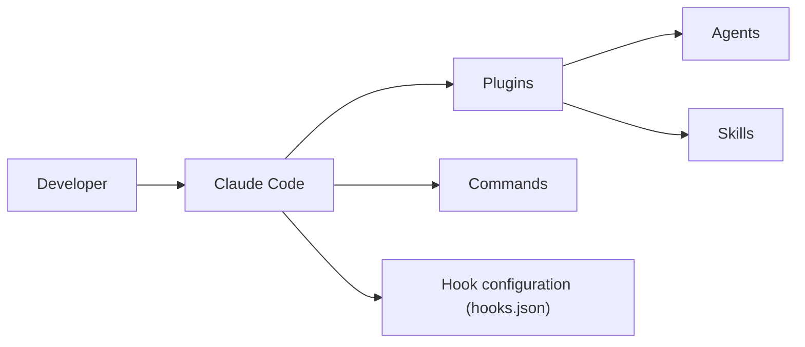

# rohitg00/awesome-claude-code-toolkit

> Catalogue d'agents, skills, commandes, hooks et plugins pour Claude Code, à piocher selon ses besoins.

## Le problème
L'écosystème Claude Code est dispersé : difficile de trouver hooks, agents ou plugins pertinents.

## Ce que ça fait vraiment
Collection annonçant 135 agents en dix catégories, 35 skills, 42 commandes, 20 hooks, 15 règles, 7 gabarits CLAUDE.md, des configs MCP et une longue liste de plugins et applications tierces avec étoiles. Ce n'est pas une application : les fichiers se copient dans `.claude/`.

## Comment c'est branché


## Essayer
```bash
/plugin marketplace add rohitg00/awesome-claude-code-toolkit
cp -r commands/ .claude/commands/
cp hooks/hooks.json .claude/hooks.json
```

## Coût et pièges
Gratuit. Le README pousse aussi un `curl | bash`. Les hooks et plugins exécutent du code sur ta machine : relire avant d'installer. Les chiffres (176+ plugins, 400 000 skills) sont des annonces du README.

## Ce que ce n'est pas
Pas un produit cohérent : un agrégateur, avec doublons et entrées de qualité inégale. Les descriptions viennent des auteurs tiers.

## Alternatives
- wshobson/agents, oh-my-claudecode, awesome-claude-code-subagents : cités dans le README.

## Pour toi
À surveiller : bon vivier d'idées de hooks et de skills, à trier soi-même ; ne pas installer en bloc.
