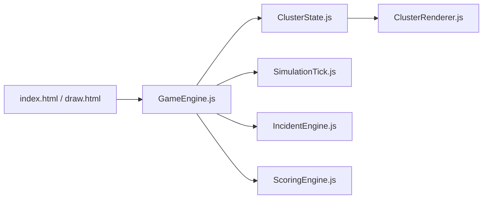

# rohitg00/k8sgames

> Simulateur 3D dans le navigateur pour apprendre Kubernetes en jouant, avec commandes kubectl réelles.

## Le problème
Apprendre à diagnostiquer un CrashLoopBackOff ou un nœud NotReady sans risquer un vrai cluster est difficile.

## Ce que ça fait vraiment
Un jeu en Three.js et modules ES sans build : 25 types de ressources (Pod, Deployment, Service, RBAC…), 29 incidents, une barre de commandes kubectl avec complétion, quatre modes (campagne de 20 niveaux, chaos, bac à sable, défis) et un score d'architecture. Un second outil, K8s Draw, sert de tableau blanc d'architecture avec export YAML ou PNG.

## Comment c'est branché


## Essayer
```bash
git clone https://github.com/rohitg00/k8sgames.git
cd k8sgames
python3 -m http.server 8080
# Open http://localhost:8080
```

## Coût et pièges
Gratuit, sans installation ni compte. Tourne en local avec un simple serveur statique. Trois.js et Tailwind sont chargés depuis un CDN, donc une connexion est nécessaire.

## Ce que ce n'est pas
Pas un vrai cluster : la simulation est simplifiée, aucun kubectl réel n'est exécuté. Ne remplace pas la pratique sur un environnement réel ni une préparation de certification.

## Alternatives
Excalidraw, cité comme point de comparaison pour K8s Draw.

## Pour toi
À surveiller : bon support d'onboarding Kubernetes pour une équipe MLOps, sans coût, à essayer en une minute.
