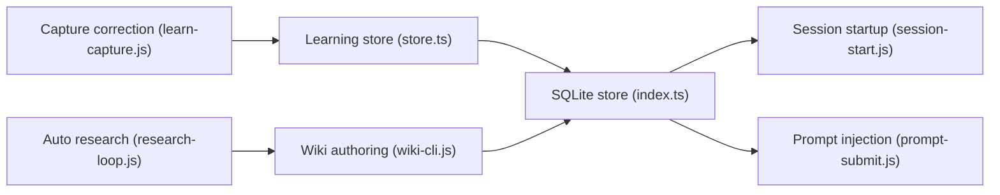

# rohitg00/pro-workflow

> Plugin Claude Code qui mémorise tes corrections et entretient des wikis consultables dans SQLite.

## Le problème
Tu corriges Claude de la même façon à chaque session, et les recherches faites disparaissent à la compaction du contexte.

## Ce que ça fait vraiment
Un magasin SQLite (FTS5) stocke les règles tirées de tes corrections, rechargées au démarrage de session. Une couche « wiki » permet de créer des wikis par sujet, interrogés par BM25 (hybride avec embeddings en option), alimentés par une boucle de recherche plafonnée en budget et un conseil multi-LLM. S'y ajoutent 41 skills, 8 agents, 23 commandes et des hooks (garde-fous git/secrets, suivi de coûts).

## Comment c'est branché


## Essayer
```bash
/plugin marketplace add rohitg00/pro-workflow
/plugin install pro-workflow@pro-workflow
/doctor
/wiki init agent-memory --title "Agent Memory" --flavor research
```

## Coût et pièges
Gratuit, mais la recherche automatique et le conseil consomment des clés d'API (budget réglable, ex. `--budget-usd 0.50`). Étape `npm install && npm run build` parfois nécessaire.

## Ce que ce n'est pas
Pas un produit mesuré : les affirmations du README (« correction rate near zero ») ne sont pas étayées par des chiffres. Aucune licence déclarée au catalogue.

## Alternatives
- Superpowers, ECC, gstack, GSD : ensembles concurrents cités dans le README.

## Pour toi
À surveiller : l'idée de mémoire de corrections est utile, mais l'absence de licence et le périmètre très large invitent à piocher quelques skills plutôt qu'à tout installer.

